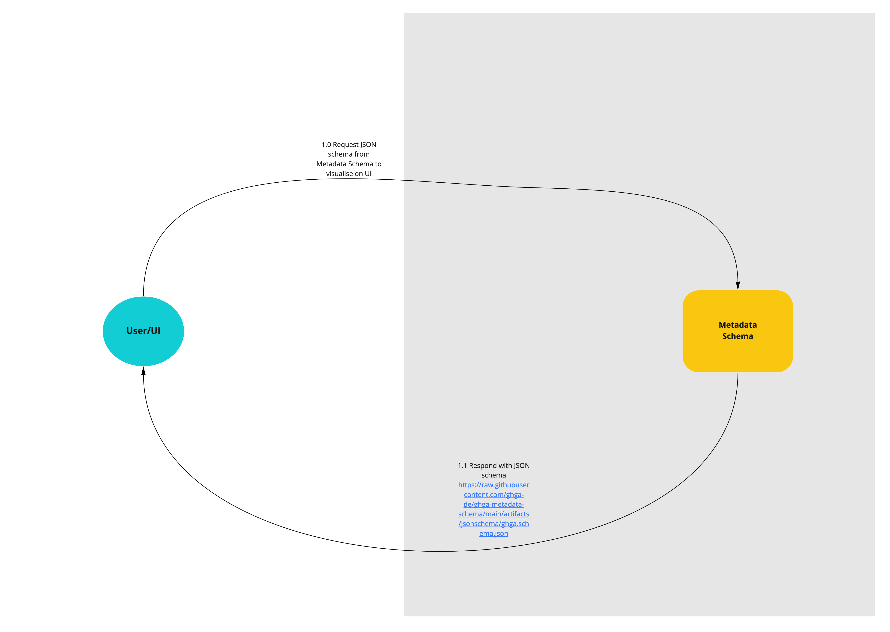
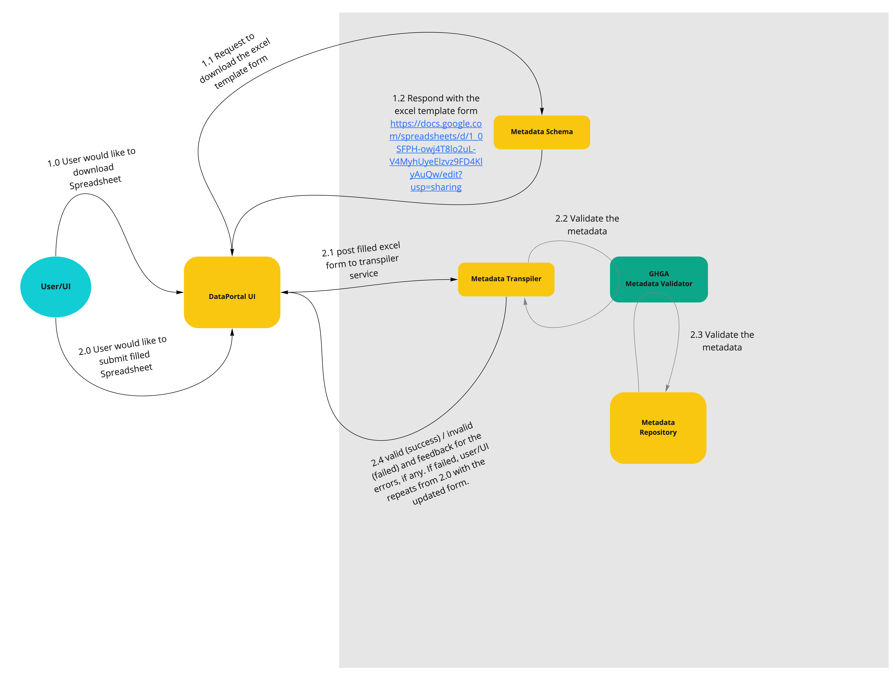
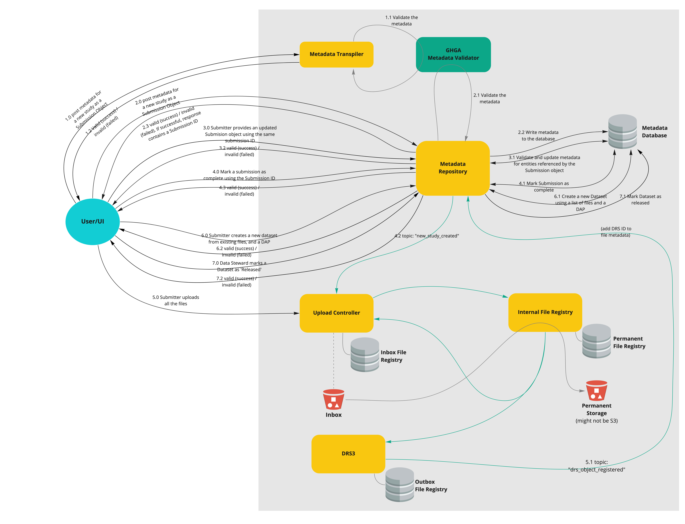
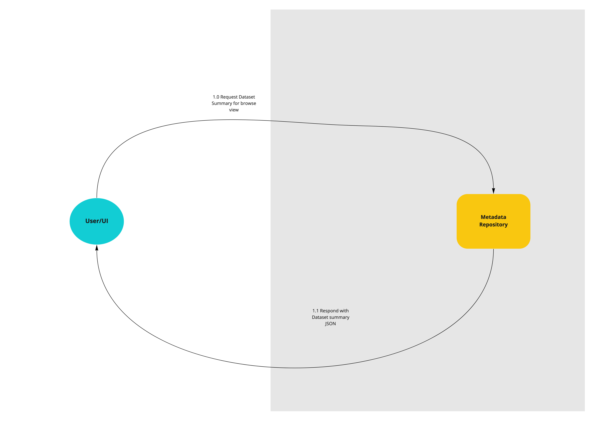
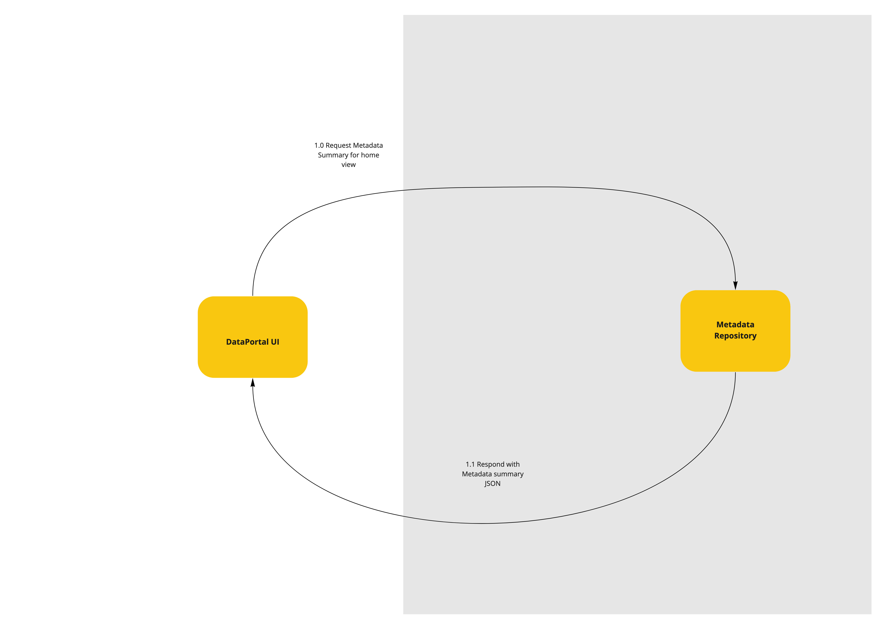

# Metadata Submission via Data Portal UI (African Bush Elephant)

## The Scope

### Summary:

The aim of this epic is to add new features and improve existing features of the Data portal UI's interaction with the Metadata Repository Service.

### Included/Required:

- Visualisation of the metadata schema in the Data portal
- Download, validate and submission of spreadsheet via Data portal
- Download of the transformed spreadsheet in JSON format via Data Portal
- Submission process of metadata via Data portal
- Extend Metadata Repository Service API to include endpoints used by data portal for
  Dataset summary and Metadata summary.

### Not included:

- user authentication & authorization
- restricted/encrypted metadata

## User Journeys

This epic covers the following user journeys:

## User Journeys that are not part of this Epic:

- Submitter wants to delete a Submission
- Submitter wants to update a submission that has already been marked 'complete'
- Submitter wants to update a submission that has already been released for public consumption
- Submitter wants to deprecate a submission and replace it with a newer submission

## API Definitions:

The definitions are hosted here:

### RESTful/Synchronous:

The RESTful service API are described using OpenAPI:

MRS: [OpenAPI YAML](api_definitions/rest/metadata_repository.yaml) [Swagger UI](https://editor.swagger.io/?url=https://raw.githubusercontent.com/ghga-de/epic-docs/cdadcf3a2926c0f564fec9c89052d43ce4eb423f/11_african-bush-elephant/api_definitions/rest/metadata_repository.yaml)

## Technical planning:

Number of sprints required: 2

Number of developers required: 2
