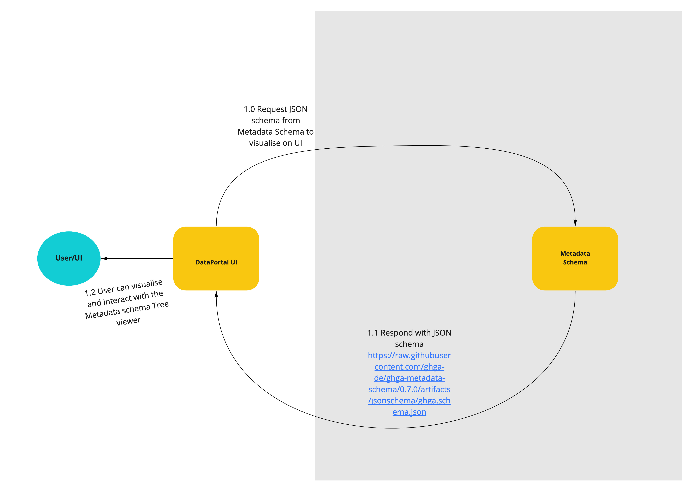
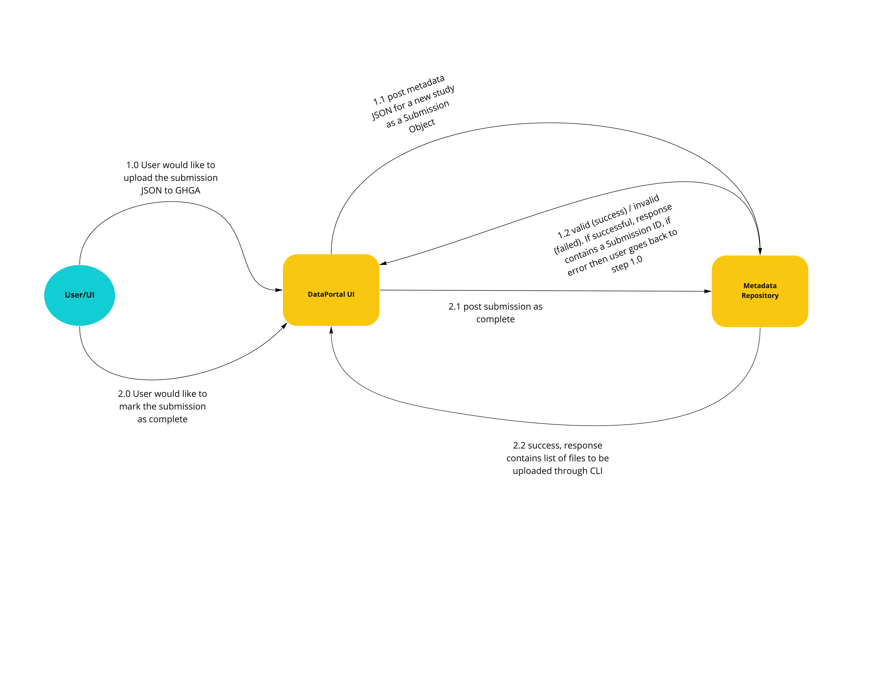

# Metadata Submission via Data Portal UI (African Bush Elephant)

## The Scope

### Summary:

The aim of this epic is to add new features and improve existing features of the Data portal UI's interaction with the Metadata Repository Service.

### Included/Required:

- Visualisation of the metadata schema in the Data portal
- Download, validate and submission of spreadsheet via Data portal
- Download of the transformed spreadsheet in JSON format via Data Portal
- Submission process of metadata via Data portal
- Extend Metadata Repository Service API to include endpoints used by data portal for
  Dataset summary and Metadata summary.

### Not included:

- user authentication & authorization
- restricted/encrypted metadata

## User Journeys

This epic covers the following user journeys:

### 1.0 User explores the Metadata Schema

On Metadata Model page load, the data portal requests the Metadata JSON schema from the Metadata Schema Service (1.0).

The Metadata Schema service responds with the metadata schema JSON (1.1).

The user is presented with an interactive JSON tree viewer rendering the Metadata Schema (1.2)

### 2.0 User downloads and uploads the submission spreadsheet.

In Metadata spreadsheet submission page, the user requests download of the Metadata submission spreadsheet by clicking the download button in the data portal (1.0).

The Data portal requests the submission Spreadsheet from the Metadata Schema Service (1.1).

Metadata Schema service responds with the submission spreadsheet that can be downloaded by the user from the data portal (1.2).

Upon filling the submission spreadsheet the user would like to submit the spreadsheet to the Data portal. (2.0)

The Data portal posts the submission spreadsheet to the Metadata Transpiler service (2.1)

The Metadata Transpiler service performs the internal validation of the submission spreadsheet by communicating with the Metadata Validator service (2.2) which in turn validates by communicating with the Metadata repository service (2.3)

The Transpiler service responds to the Data portal (2.4) with either success and transformed Metadata JSON or validation errors. If validation errors are received the user goes back to the 2.0 step by fixing the validation error and submitting the spreadsheet once again to the Data portal.

### 3.0 User submits the metadata JSON to Data portal.

After successful download of the Metadata JSON by the user, the user may submit the Metadata JSON to the data portal (1.0).

The Data portal posts the Metadata JSON to the Metdata repository as a new Study submission object (1.1).

The Metadata repository service responds (1.2) with either success along with an updated Metadata JSON that contains the submission IDs or validation errors, in which case the user goes back to 1.0 abd attempts to submit the JSON again after fixing relevant submission errors.

After the successful submission, the user would like to mark the submission as complete (2.0) in the Data portal.

Data portal UI posts the mark as complete for the submission to the Metadata repository service (2.1)

Metadata Repository service responds with the success and a list of files to be uploaded by the user (2.2). This information can be accessed on the data portal by the user and the user may be provided with the instructions to upload the files using the CLI services.

### 4.0 DatasetSummary.

Data portal requests DatasetSummary for the Browse view from the Metadata Service (1.0)

Metadata Service responds with the DatasetSummary JSON (1.1)

### 5.0 MetadataSummary.

Data portal requests MetadataSummary for the Home view from the Metadata Service (1.0)

Metadata Service responds with the MetadataSummary JSON (1.1)

## User Journeys that are not part of this Epic:

- Submitter wants to delete a Submission
- Submitter wants to update a submission that has already been marked 'complete'
- Submitter wants to update a submission that has already been released for public consumption
- Submitter wants to deprecate a submission and replace it with a newer submission

## API Definitions:

The definitions are hosted here:

### RESTful/Synchronous:

The RESTful service API are described using OpenAPI:

MRS: [OpenAPI YAML](api_definitions/rest/metadata_repository.yaml) [Swagger UI](https://editor.swagger.io/?url=https://raw.githubusercontent.com/ghga-de/epic-docs/cdadcf3a2926c0f564fec9c89052d43ce4eb423f/11_african-bush-elephant/api_definitions/rest/metadata_repository.yaml)

## Technical planning:

Number of sprints required: 2

Number of developers required: 2
