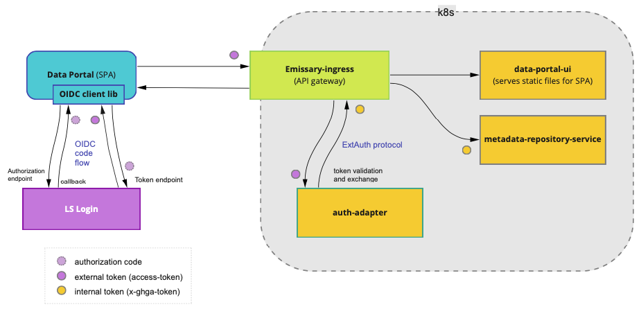

# OIDC and API gateway integration (Coral Guard Crab)

**Epic Type:** Implementation Epic

## Scope

Make [LS Login Demo](https://github.com/ghga-de/ls-login-demo) production ready.

## User Journeys

## Implementation Details

- Replace nginx-ingress with Emissary-ingress in dev k8s
- Design simple login UI
- Implement designed login UI with dummy functions
- Briefly evaluate certified alternative to oidc-client-ts library
- Make login UI functional (run OIDC code flow)
- Move existing auth service code to new "auth adapter" repository
- Deploy auth adapter service
- Make auth adapter more functional (adapt authentication rules, add validation, provide more useful internal token)
- Log internal token in metadata repository service at debug level

## Time Estimation

- Start: August 9
- Due: August 26
