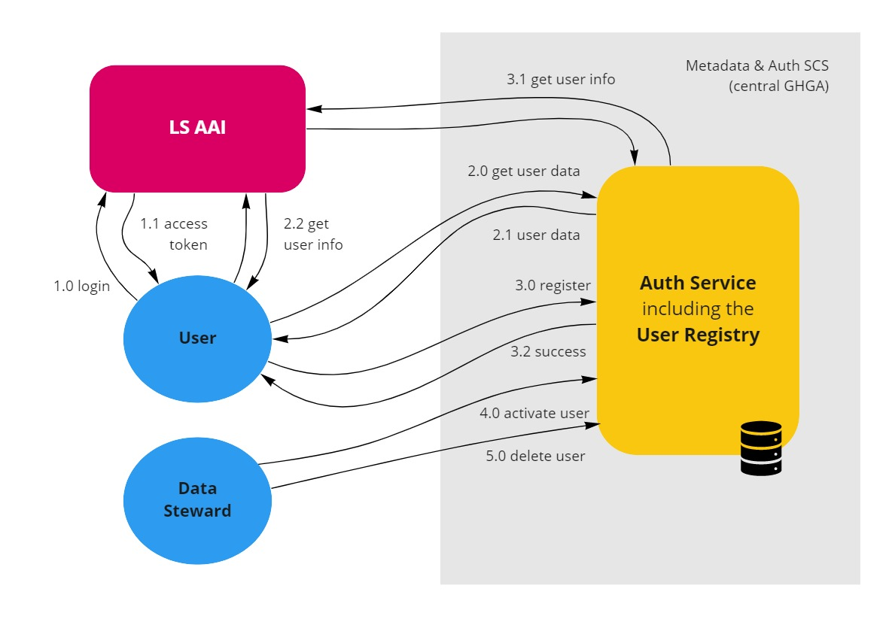
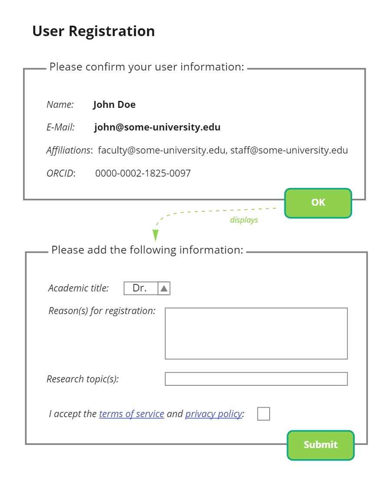
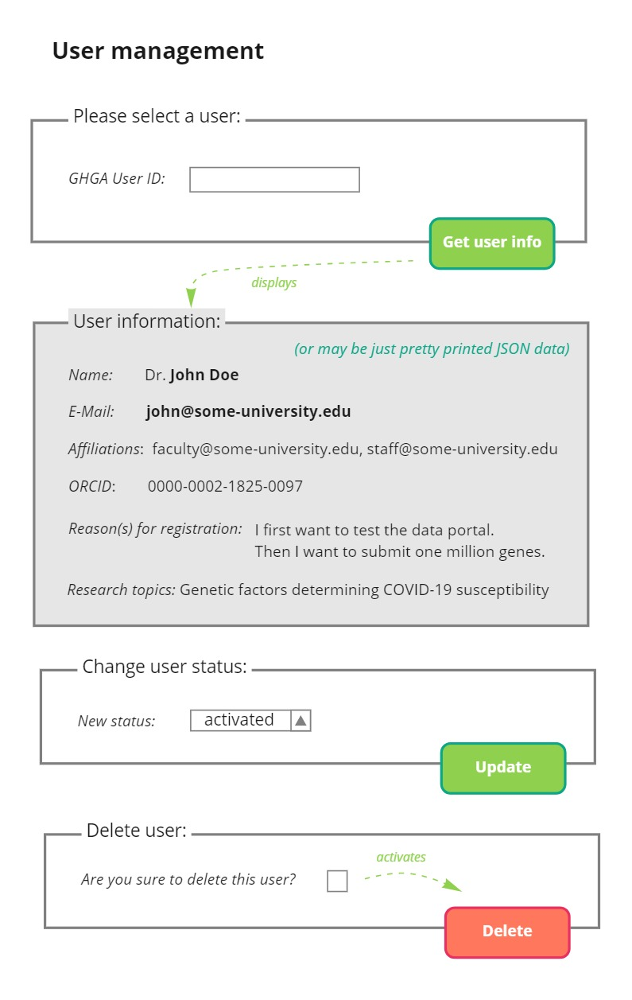

# Basic User Registry (Morning Sun Star)

**Epic Type:** Implementation Epic

## Scope

Implement the basic user registry backend as part of the auth service and provide a simple UI.

## User Journeys

This epic covers the following user journeys:

### User registers with GHGA

(1.0) The user logs in using LS Login via the data portal SPA. This requires prior registration with LS Login when the user is not already registered there.

(1.1) As result of the OIDC flow, LS Login sends an access token back to the SPA which keeps it for the rest of the user session.

(2.0) The SPA sends a request to the "get user data" endpoint in order to get the basic user information and to check whether the user is already registered. As part of the request, it also submits the user id from the LS Login access token.

(2.1) The Auth Service responds by sending the user data back to the SPA if a user with the given LS Login user ID is found in the user registry database. In this case the user has been already registered and the user journey ends here.

Additionally, the auth service should request the user information from the UserInfo endpoint of LS Login and verify that the information is identical with the information that has been stored in the internal database. This is similar to (3.1). If there is a mismatch, the auth service should set the user status to "deactivated" and send a notification to a data steward. In this case, the SPA should inform the user which part of the information has changed and present the registration form again to confirm the changed information.

(2.2) If the user is not found in the database, the Auth Service responds with a "user not found" error message. In this case, the user still needs to register with GHGA, the SPA gests the user from the UserInfo endpoint of LS Login using the access token it kept in (1.1). It then asks the user to register with GHGA.

(3.0) The user fills the registration form in the SPA (see below) which is pre-populated with the data the SPA has retrieved in (2.2). This data is then submitted to the "register user" endpoint of the Auth Service.

(3.1) The Auth Service requests the user information from the UserInfo endpoint of LS AAI. This should be done by the internal auth adapter when it detects that the "register user" endpoint has been hit, and the user information should then be made available in the internal access token. The auth service then checks whether the information provided by the user matches the information provided by LS AAI in the fields that origin from the OIDC provider (see below). If this check passes and the data is valid, the user is saved in the database, an internal ID is created and  sent back to the SPA as part of the user data. Also a data steward is notified about the newly registered user.

### Data steward activates user

(4.0) Upon receipt of the notification that a user has been registered, the data steward also logs in to the data portal and navigates to the user management form (see below) and enters the internal user ID to retrieve the user information. After checking the user registration, the data steward sets the status of the user to "activated" (or to "deactivated" if the registration does not seem to be legit). This is done via the SPA using the "modify user data" endpoint of the Auth Service.

(4.1) A notification is sent to the user, letting the known that they have been activated.

### Data steward deletes user

(5.0) Users can request the deletion of their user data. Such requests are handled via the data steward. The data steward logs in to the data portal and navigates to the user management form (see below) and enters the internal user ID to retrieve the user information. After checking that the correct user has been selected and confirming this using a checkbox, the data steward hits the user deletion button. The user is then deleted via the SPA using the "delete user" endpoint of the Auth Service.

(5.1) A notification is sent to the user, letting them known that their data has been deleted as requested.

## API Definitions

The definitions are hosted here:

### RESTful/Synchronous

The RESTful service API is described using OpenAPI:

**User Registry Service**: [OpenAPI YAML](api_definitions/rest/user_registry.yaml), [Swagger UI](https://editor.swagger.io/?url=https://raw.githubusercontent.com/ghga-de/epic-docs/main/15-morning-sun-star/api_definitions/rest/user_registry.yaml)

### Payload Schemas for Asynchronous Topics

The notifications mentioned in the user journey and the payloads for asynchronous topics will be defined and implemented in a different epic.

## Additional Implementation Details

### User data

Note that a part of the use data originates at the external identity providers (LS Login or home organization). This part of the user data is also stored internally, but the user information from the external identity providers delivered via the UserInfo OIDC endpoint is considered the "source of truth" for this part of the user data and may not be altered by the user on our side, but must be changed at the side of the identity provider if needed. Note that LS Login allows selecting a preferred e-mail address that is also verified. The consistency of the external and internal user information is checked when a user registers and logs in. If there is a mismatch, the user registration will failed or an already registered user will be deactivated until a data steward confirms the change.

This part of the user data that is kept in sync with the external identity provider consists of the following fields:

- ls_id (LS Login ID)
- name (full name, see below)
- email

The name can also be stored in two separate components (first name and last name or given name and family name) if these can be reliably retrieved via OIDC - currently only the full name (display name) is documented for LS Login. Also note that the semantics of these name parts can be different for international users coming from different cultures.

The following fields that are provided by the external identity provider are currently *not* requested and synchronized:
- affiliation
- orcid

Therefore, it may be possible to extract all the necessary information from the access token or ID token alone, and the requests to the UserInfo endpoint of LS Login can be omitted.

The part of the user data that is not provided externally must be provided in the registration process and consists of the following fields:

- academic title
- reason for registration
- research topic(s)

### User registration form

The user registration form should roughly look like this:

### User management form

The user management form should roughly look like this:

## Time Estimation

- Start: August 29
- Due: September 9
