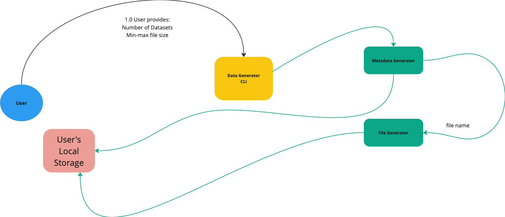
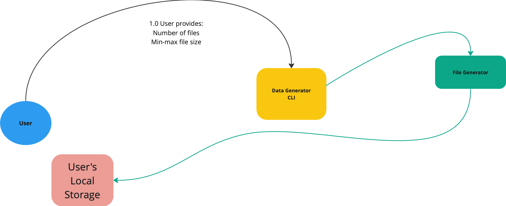

# Synthetic Data Generator (White Stork)
**Epic Type:** Exploratory Epic

The goal is to create a prototype.

<!-- **Attention: Please do not put any confidential content here.** -->

## Principle Components of Exploration:

- Metadata generator based on GHGA model
    - Controlled vocabulary for CV fields
    - (Random but realistic) Value in non-CV data fields following right data type
    - Dataset generator
    - Submission JSON model
    - Post creation json model
    - Data model multiplicities
    - Connectivity of the classes
    - Realistic file name and size
- FASTQ file generator
    - Employ dummy_data_generator
    - Storage space requirements (platform selection: ABI cluster or de.NBI)
- Connection between metadata and file generators for file related parameters
- Run time - Not a focus on the performance, but aim for reasonable

<!-- ## Material and Resources:
 -->

## User Journeys

This epic covers the following user journeys:

### User reguests both metadata and correspoding files

### User requests only metadata

### User requests only fastq files

<!-- ## User Journeys that are not part of this Epic:
\<This is optional for exploratory epics\>
#
- \<Provide a list here.\> -->

<!-- ## Additional Implementation Details:

- \<List further implemenation details here. (Anything that might be relevant for defining and executing tasks.)> -->

## Human Resource/Time Estimation:

Number of sprints required: 3

Number of developers required: 3
