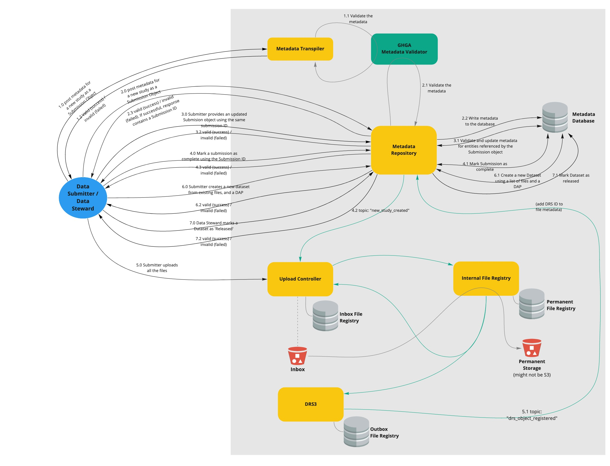

# Metadata Submission via REST API (Horseshoe Bat)

## The Scope

### Summary:

The aim of this epic is to extend the "Blobfish" version of the Metadata Repository Service
to include a submission API.

Moreover, the service should be integrated into the mesh of file-oriented services
("Red-lipped Batfish" epic).

### Included/Required:

- strategy for data submission interface via spreadsheet
- implement service that validates a spreadsheet and transforms it into a JSON object
ready to use for submission to the Metadata Repository Service API
- extend Metadata Repository Service API to include endpoints used by data submitters
- publish event upon submission of metadata for new study receive once file has been uploaded
and is available for download (has a DRS URI)

### Optional:

- metadata update/versioning
- UI implementation

### Not included:

- user authentication & authorization
- restricted/encrypted metadata

## User Journeys

This epic covers the following user journeys:

### 1.0 Data Submitter submits their metadata spreadsheet to the Metadata Transpiler Service

The Data Submitter submits their metadata spreadsheet to the Metadata
Transpiler Service (MTS) (1.0).

The MTS first converts the spreadsheet into a Submission JSON.

Then the MTS validates the metadata by making use of the GHGA Metadata Validator (1.1)

- If the validation passes, the prepared Submission JSON is sent back to the
Data Submitter (1.2)
- If the validation fails, then the Data Submitter is notified (1.2) along 
with the validation errors

### 2.0 Data Submitter submits a Study as part of a Submission

The Data Submitter submits the Submission object to the Metadata Repository Service (MRS)
as a HTTP POST request.

The MRS validates the incoming Submission object, and all of the associated entities.

Upon successful validation, the MRS assigns a Submission ID (unique identifier) to the Submission.
Then the Submission object, and its associated entities, are written to the metadata store (2.1).

Upon a successful write operation, the Submission object (which includes a Submission ID) is
returned to the Data Submitter for reference. If the validation fails then the data submitter
is notified of a failure (2.2).

**Note:** A Submission can have one of the following status: `in progress` and `completed`.
At this stage, the Submission is considered as 'in progress'.

### 3.0 Data Submitter wants to update a Submission

Due to data preparation issues it is possible that a Data Submitter would like to update a
previous Submission.

The Data Submitter can do so by making use of the Submission ID (provided to them in 2.2).

The Data Submitter prepares the updated Submission object (by repeating steps in 1.0).

i.e. if the Data Submitter needs to update just one Sample that is part of a Study, then
the Data Submitter should still prepare the entire Submission object.

The updated Submission object is then sent to the MRS as a HTTP POST request.

The MRS again validates the incoming Submission object, and all of its associated entities.

Upon successful validation, the MRS looks up the existing Submission (3.1) using
the Submission ID and:
- If the Submission object is marked as 'submitted' then this update operation will fail and the
Data Submitter will be notified of failure
- If the Submission object is not marked as 'submitted' then the MRS updates the Submission object
in the database and the Data Submitter will be provided with the updated Submission object as a response (3.2)

**How does the update operation work?**

Since the updated Submission object is the entire Submission, all entities created in 2.1 will be
deleted and the new entities will be created.

### 4.0 Data Submitter/Data Steward wants to update status of their submission to 'submitted' (i.e. complete)

Once the Data Submitter (or a Data Steward) is comfortable with the accuracy of their submission,
they can explicitly mark a Submission as complete.

To do so, the Data Submitter/Data Steward sends a HTTP POST request to the MRS with the Submission
ID that is to be marked as complete.

The MRS looks up the existing Submission (4.1) using the provided Submission ID and marks
the status of the Submission object (and linked Study object) from 'in progress' to 'submitted'.

Then the MRS:

- publishes a message to the `new_study_created` topic (4.2).
- listens to the `drs_object_registered` topic (5.1) to get the DRS ID, for each registered
file, from the Upload Controller.
- Assigns accession to all the objects that are linked via the Submission object. This is
because ULC requires the accession (not the internal unique ID) for upload

Upon successful completion, the MRS provides the same Submission ID back to the Data
Submitter/Data Steward (4.3).

**Note:** At this stage, the Submission is considered as complete. No further updates possible
(within the scope of functionality provided by this milestone).

### 5.0 Submitter uploads all the files that are part of this submission via the Upload Controller

Now the Data Submitter submits all the files, using file accessions, that are part of the Submission
via the Upload Controller.

The individual steps for this process are detailed in
[1 - Red-lipped Batfish - Basic File IO Service](https://wiki.verbis.dkfz.de/display/GHGA/1+-+Red-lipped+Batfish+-+Basic+File+IO+Service).

### 6.0 Create a new Dataset from one or more files

The Data Submitter/Data Steward can now create a Dataset with one or more files.

To do so, first the Data Submitter/Data Steward must create a Data Access Policy (DAP) that
represents the set of data access restrictions that ought to be applied to a Dataset
and links it to a Data Access Committee (DAC) that is responsible for managing restricted
access for a Dataset. If the DAC does not exist then the Data Submitter/Data Steward should
first create a DAC, and then a DAP.

#### Creating a Data Access Committee

The Data Submitter/Data Steward first sends a POST request to the `/data_access_committees`
endpoint of the MRS with the required metadata to create a new DAC (6.0).

The MRS then creates a DAC entity with the provided metadata (6.1).

Upon successful creation of a DAC, the MRS responds with the a DAC Accession (6.2).

This DAC Accession is required for the creation of a DAP.

#### Creating a Data Access Policy

The Data Submitter/Data Steward sends a POST request to the `/data_access_policies` endpoint
of the MRS with the required metadata (which includes a DAC Accession) (6.3).

Using the DAC Accession, the MRS will first check if the DAC actually exists (6.4). Then it will
create a Data Access Policy entity and link the DAP with the DAC.

Upon successful creation of a DAP, the MRS responds with a DAP Accession (6.5).

This DAP Accession is required for the creation of a Dataset.

#### Creation of a Dataset

To do so, the Data Submitter/Data Steward sends a HTTP POST request to the `/datasets` endpoint
of the MRS with a list of File Accessions, and a Data Access Policy Accession that applies
to the Dataset (and thus applies to files that are part of this Dataset) (6.6).

The MRS ensures that the Files and the DAP exists. Then it creates a
new Dataset object with the files, collates all the linked metadata at the Dataset level,
and attaches the given DAP to the Dataset (6.7).

Upon successful completion, the MRS provides the Dataset Accession to the Data
Submitter/Data Steward (6.8).

### 7.0 Data Steward marks a Dataset as released

A Dataset is not publicly available until its status is changed to `released`.

To do so, a Data Steward sends a HTTP PATCH request to the MRS with a Dataset ID
and `status: released`.

The MRS looks up the corresponding Dataset and changes its status from `unreleased`
to `released` (7.1). This ensures that the Dataset is now released for public consumption.

## User Journeys that are not part of this Epic:

- Submitter wants to delete a Submission
- Submitter wants to update a submission that has already been marked 'complete'
- Submitter wants to update a submission that has already been released for public consumption
- Submitter wants to deprecate a submission and replace it with a newer submission

## API Definitions:

The definitions are hosted here:

### RESTful/Synchronous:

The RESTful service API are described using OpenAPI:

MRS: [OpenAPI YAML](api_definitions/rest/metadata_repository.yaml) [Swagger UI](https://editor.swagger.io/?url=https://raw.githubusercontent.com/ghga-de/epic-docs/cdadcf3a2926c0f564fec9c89052d43ce4eb423f/2_horseshoe_bat/api_definitions/rest/metadata_repository.yaml)

### Payload Schemas for Asynchronous Topics:

The payloads for asynchronous topics are described using JSON schemas:

- new_study_created: [JSON Schema](https://raw.githubusercontent.com/ghga-de/epic-docs/main/1_red-lipped_batfish/api_definitions/message_topics/new_study_created.json)

## Technical planning:

Number of sprints required: 2

Number of developers required: 2
