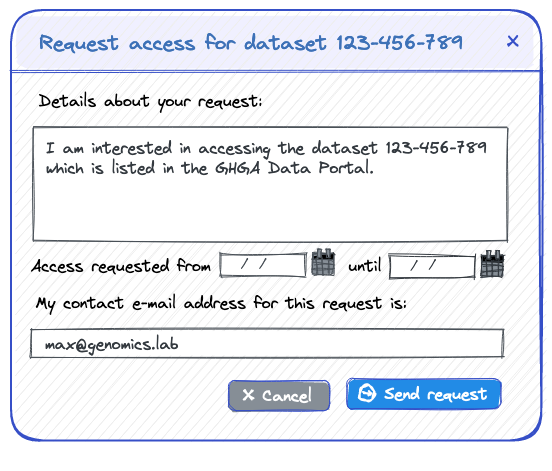
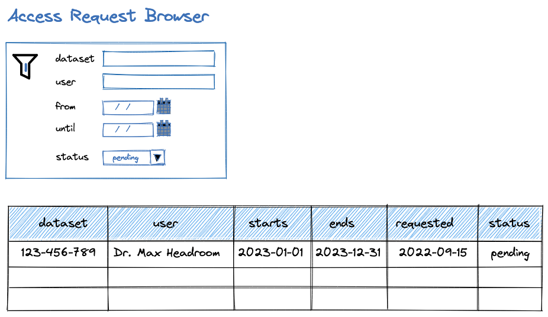
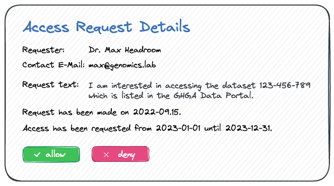
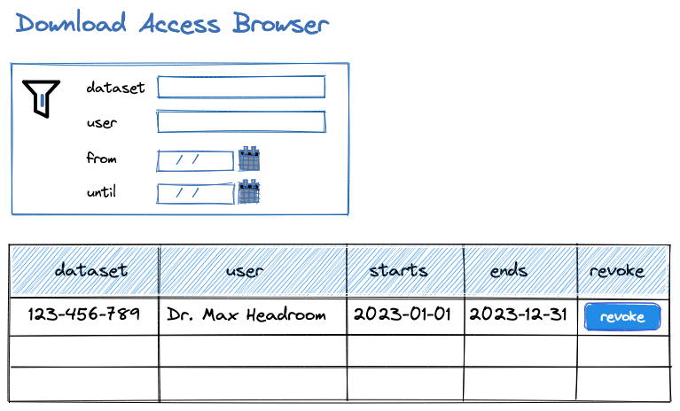

# Download Request Management (Green Wrasse)

**Epic Type:** Implementation Epic

## Scope

### Outline

This epic covers the implementation of functionality for managing access to datasets.

### Included/Required

The epic includes:

- development of a backend service "Access Request Service" (ARS) that
  stores access requests by users and allows changing their state by data stewards
- additions to the Claims Repository Service to support the ARS
- the functionality for users to send download access requests
  in the Data Portal UI
- the functionality for data stewards to browse, allow or deny such requests
  in the Data Portal UI

These parts of the epic are described in detail below.

### Not included

This epic does not include:

- Functionality for users to list their requests with their current state
  or to notify users in the frontend about status changes after logging in.
- Functionality for data stewards to browse and change existing download
  access permissions in the Claims Repository, as outlined below.
- Management of upload requests. Potentially, the same service could be
  later extended to cover upload access management as well.
- Functionality for managing access directly by the DAC (data access committee)
  or to support the decision making and communication between the involved
  parties (DAC, RDC, DR). It assumes that a GHGA data steward is acting as a
  broker and drives the process manually.

## User Journeys

Actors: Data Requester (DR), Data Steward (DS).

When data is requested:

- DR finds and views a dataset in the Data Portal
- DR clicks on "Request access" button for a dataset
- If user is not yet logged in via LS Login, user is required to do so
- Form is displayed with info on required information from requester
- DR fills required fields:
  - pre-filled text field for details about the request
  - pre-filled requested access start and end dates
  - contact email, pre-filled with the email of the DR
- DR clicks on "Continue"
- A preview of the sent data (text, dates, e-mail) is shown
  in order to let the DR confirm sending this request
- DR clicks on "Submit request"
- The access request is stored in the backend database
- Notification email is sent out to DS
- Confirmation email is sent out to DR

When access was granted or denied:

- DS logs in to Data Portal
- DS views list of access requests
- DS finds access request of DR
- DS changes the status from "pending" to either "allowed" or "denied"
- Notification email is sent out to DR
- Confirmation email is sent out to DS
- DR logs in to Data Portal
- DR visits the download or profile page
- DR should see the newly accessible dataset
- DR can now create a work package for download.
Creating work packages is covered by
[epic 26](https://github.com/ghga-de/epic-docs/blob/main/26-dracula-ant/technical_specification.md).

## API Definitions

The Access Request Service REST API should have the following endpoints:

Used by the web frontend to create and view access requests:

- `POST /access-requests`
  - auth header: internal access token
  - request body:
    - `user_id`: string (the registered user ID of the requester)
    - `dataset_id`: string (the ID of the requested dataset)
    - `email`: string (the contact email address of the requester)
    - `request_text`: string (the text submitted with the request)
    - `access_starts`: date (optional, when access should start)
    - `access_ends`: date (optional, when access should end)

The response body should include the ID of the newly created access request,
although this is currently not used by the frontend.

Used by the web frontend to fetch all existing requests:

- `GET /access-requests`
  - auth header: internal access token
  - query parameters (optional):
    - `dataset_id`: string (a dataset ID)
    - `user_id`: string (a registered user ID)
    - `state`: an access request state

This endpoint gets the existing requests, filtered using the specified
query parameters, and ordered by descending creation date.

If the user specified in the access token does not have a data steward role,
the `user_id` parameter is assumed to be the ID of that user,
and an authorization error is returned if a different `user_id` is passed.

The response body should be an array of Access Request Objects as described
below.

Note that currently we do not support parameters for filtering according to
dates and limiting results or pagination, but these may be added later.

Since the frontend first loads all relevant objects using this end point,
these can be used in the detail view as well, and the backend does not need
to provide a separate endpoint for getting individual Access Request Objects.

Used by the web frontend to modify the status of an existing request:

- `PATCH /access-requests/{access_request_id}`
  - auth header: internal access token
  - request body:
    - `status`: enum (allowed/denied/pending)

This endpoint should return an authorization error if the user specified
in the access token does not have the data steward role.

It sets the status of the specified access request to the given state and
also stores in the database the user ID of the data steward and the date
when the change was made.

Note that we currently only allow status transitions from "pending" to
"allowed" or "denied". All other changes should return an error.

Transitions from "denied to "pending" or "allowed" to "denied" may later
be supported as well. In the latter case, care must be taken to remove existing
access grants. Edge cases should be handled carefully (user having access
grants for the same dataset with different validity periods).

If further status changes will be later allowed, it should be also considered
to store information about these changes in a history and/or to send a change
to an audit service when a status change was made.

The request body currently does not include `access_starts` and `access_ends`
dates, since these are taken from the request. This means that we currently
do not support changing the requested validity period.

## Additional Implementation Details

### Access Request Object

The access requests are stored in the database with the following details:

- `id`: string (the auto generated ID of this object)
- `user_id`: string (the registered user ID of the requester)
- `dataset_id`: string (the ID of the requested dataset)
- `full_user_name`: string (the full user name with title)
- `email`: string (the e-mail address of the requester for notifications)
- `request_text`: string (the text submitted with the request)
- `access_starts`: data (when the access permission should start)
- `access_ends`: date (when the access permission should end)
- `request_created`: date (when the request has been created)
- `status`: enum (allowed/denied/pending)
- `status_changed`: date (when the status was last changed)
- `changed_by`: string (user ID of the data steward)

The `status` field should be automatically set to "pending" upon creation,
and the `request_created` field should be filled with the current date.

The `email` address is stored in order to notify the user. This address can
be different from the registered user address. The `full_user_name` is stored
so that it can be displayed in the Access Request Browser without requesting
it from the User Registry.

Again, note that we maintain only one pair of dates to specify the validity
period, not separate pairs for requested and actually allowed periods. This
could be changed later if it turns out to be necessary.

### Communication with the Claims Repository

When changes to the status of an access request have been made, these need to
be communicated to the Claims Repository, which is the source of truth for all
controlled access grants in GHGA.

To allow the ARS to send changed permissions to the Claims Repository,
the latter provides the following *internal* endpoint:

- `POST /download-access/users/{user_id}/datasets/{dataset_id}`
  - authorization: only internal from ARS (via service mesh)
  - request body:
    - `access_starts`: date
    - `access_ends`: date
  - returns nothing

This will add a controlled access grant for the specified user and dataset
with the given dates will be added to the Claims Repository.

In order to facilitate authorization, the path of these endpoints starts with
`download-access` and not with `users` which is already used by other endpoints
of the user registry and claims repository. Also note that a corresponding
GET endpoint already exists for use by the Download Controller Service.
A service mesh policy should be implemented that allows the Access Request
Service to only use the POST method, and the Download Controller Service to
only use the GET method.

### Configuration

In order to know which data stewards should be notified, the configuration of
the service should include a parameter that is a list of all email addresses
that should be notified. This could be set to the email address of one or
more responsible data steward(s), or just contain the email of the help-desk.

The configuration should also contain parameters for the maximum time interval
that the start date of the access request can be postponed and the default and
maximum time interval between start date and end date (access validity period).
This configuration must be added to both the Data Portal and the ARS, since it
is used for default values and validation on both the frontend and the backend.
We may consider postponing the functionality to change these values; specifying
the default access validity in the backend should then be enough.

In order to make sure that the data stewards are known to the system, the
configuration of the Auth Service (Claims Repository) should be extended with
a parameter to specify a list of LS Login IDs of the data stewards. When the
service starts, these users will be automatically added as data stewards to
the Claims Repository.

### Request Submission Form

The UI currently provides a button "Request access" that opens a form that
allows sending a request to a DAC team via email. This form should be changed
so that instead the request is stored in the backend database via the endpoint
described above. The backend should then inform a data steward and the user
via email that the new request has been registered.

The new dialog for sending data access requests could look like this:

The text for the request should be pre-filled and contain the ID (and maybe
also the title) of the requested dataset.

The dates should be pre-filled and validated using the configuration parameters
explained above. The email field should be pre-filled with the registered email
address of the user.

After submitting the form, a confirmation dialog with the submitted data should
be shown before the request is actually sent. The submit button could be labeled
"Continue" on the data entry dialog and "Send request" on the preview dialog.

### Access Request Browser

The UI should provide data stewards with functionality to list all access requests
in tabular form, with filters for dataset, user and status (which can be all,
pending, denied, accepted). The "from" and "until" fields shown here can be
implemented later, they are not part of this epic.

### Access Request Details

When a row in the table is selected, a detail view should appear that shows the
request details. When the access request access is still pending, the detail
view should also provide buttons to allow or deny the request.

This means we currently only support access requests to transition from "pending"
to "allowed" or "denied".

### Download Access Browser

In addition to managing access requests, it is necessary that data stewards can
also view and manage the actual access grants as they are stored in the claims
repository, and to revoke existing access grants independently of requests.

This functionality is not part of this epic, but already outlined here.

In addition to the Access Requests Browser described in this spec, an Access
Browser should be provided to data stewards in the UI. Similarly to the Access
*Request* Browser, the *Access* Browser should have a filter component that allows
filtering for dataset id, user name and date ranges.

These two different browsers could be shown using a tabbed interface, with one
tab labeled "Access Requests" and the other one "Access Grants".

Each row in the Access Browser should consist of one Access object dataset which
corresponds to a Claim object of type ControlledAccessGrant for a GHGA dataset
in the claims repository. The Access object should have the following fields:

- `id` string (access object ID, same as ID of corresponding claim)
- `dataset_id` string (the ID of the dataset)
- `user_id` string (the internal user ID)
- `full_user_name` string (the full user name with title)
- `email` string (the registered email address of the user)
- `access_starts` date (start date of the access grant)
- `access_ends` date (end date of the access grant)

The UI could look like this:

When clicking the revoke button, a confirmation dialog should appear, and
after confirmation, the access grant should be removed from the claims repository.

Note that the filter and table components in the Access Browser could be re-used
from the Access Request Browser that is implemented in this epic.

To support this functionality, the claims repository should provide an additional
*internal* endpoint:

- `GET /download-access/`
  - authorization: only internal from ARS (via service mesh)
  - query parameters (optional):
    - `user_id`: string (a registered user ID)
    - `dataset_id`: string (a dataset ID)
    - `access_starts` date (start date of the access grant)
    - `access_ends` date (end date of the access grant)

This endpoint gets the access objects corresponding to ControlledAccessGrants
in the Claims Repository, filtered using the specified parameters, and ordered
by descending creation date.
If the user specified in the access token does not have a data steward role,
the `user_id` parameter is assumed to be the ID of that user,
and an authorization error is returned if a different `user_id` is passed.

The response body should be an array of Access objects as described above.

For deleting (revoking) existing access grants in the Claims Repository,
the already existing endpoint to delete a Claim object can be used, since the
ID of the Data Access object is the same as the one of the corresponding
Claim Object.

Both of these endpoints of the Claims Repository should be proxied by the ARS
to allow client access by data stewards, since the Clais Repository does not
have a public API that can be used by data stewards.

## Human Resource/Time Estimation

Number of sprints required: 2

Number of developers required: 2
