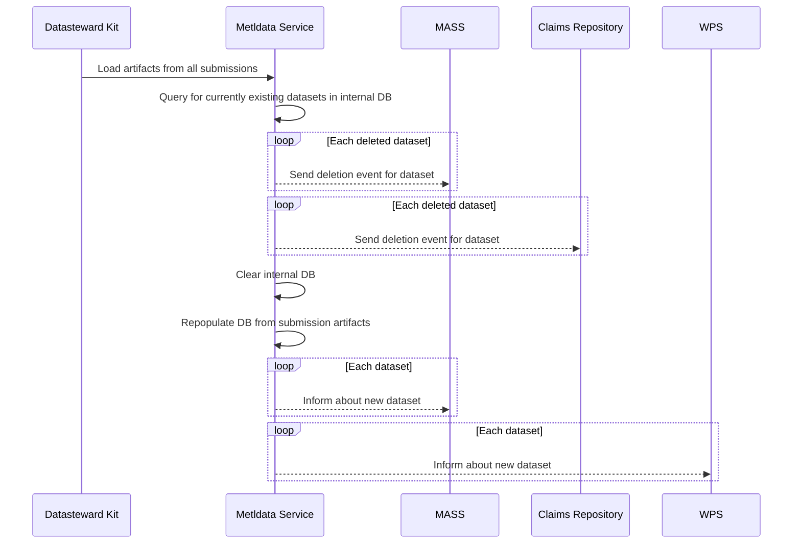

# Missing Glue Code for Metadata Ingress Inter-service Communication (Tokay Gecko)
**Epic Type:** Implementation Epic

## Scope

This epic aims to fill in the missing parts in inter-service communication along the preliminary upload/ingress path provided for 1.0.

### Outline:

#### Metldata Service:

- Implement publisher for deletion and population events
- Needs to clear and repopulate own DB to track current datasets

#### MASS:

- Add event subscriber for deletion and population events
- Add functionality to populate entities
- Add functionality to delete entities
- embedded_dataset artifact as input in form of MASS models.Resource
- Kafka Key Name: dataset_ebmedded_{id}

#### WPS:

- Receive event conforming to MetadataDatasetOverview from Metldata Service
- Adjust event subscriber config for population events (if needed)
- Kafka Key Name: dataset_embedded_{id}

#### Auth Service Claims Repository

- Add event subscriber to delete controlled access grant claims for a specific dataset

#### Sequence Diagram for Proposed Interactions

Kafka topic has to be the same for deletion and creation (where applicable) to guarantee order for events with same key - use type to distinguish.

## Human Resource/Time Estimation:

Number of sprints required: 1

Number of developers required: 2
