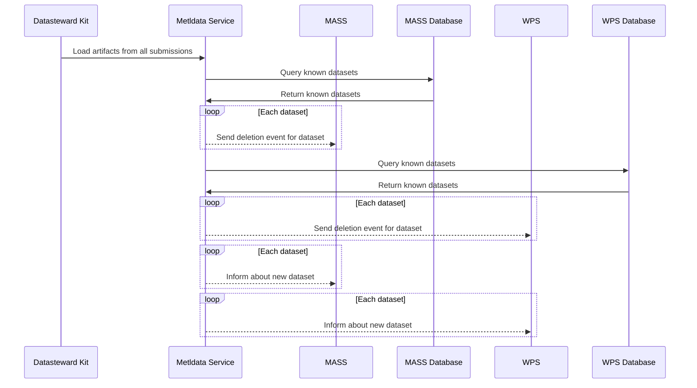

# Missing Glue Code for Ingress Inter-service Communication (Tokay Gecko)
**Epic Type:** Implementation Epic

## Scope

This epic aims to fill in the missing parts in inter-service communication along the preliminary upload/ingress path provided for 1.0.

### Outline:

#### Metldata Service:

- Implement publisher for deletion and population events
- Needs to know about MASS and WPS DB and be able to query them
- Invesigate: Communication with MASS DB might be possible through existing API

#### MASS:

- Add event subscriber for deletion and population events
- Add functionality to populate entities
- Add functionality to delete entities
- embedded_dataset artifact as input in form of MASS models.Resource
- Kafka Key Name: dataset_ebmedded_{id}

#### WPS:

- Question to solve: Which service produces DatasetOverview?
- Add event subscriber config for deletion and population events
- Add functionality to delete datasets
- Kafka Key Name: dataset_embedded_{id}?

#### Sequence Diagram for Proposed Interactions

Kafka topic has to be the same for deletion and creation to guarantee order for events with same key - use type to distinguish

## Human Resource/Time Estimation:

Number of sprints required: 1

Number of developers required: 2
