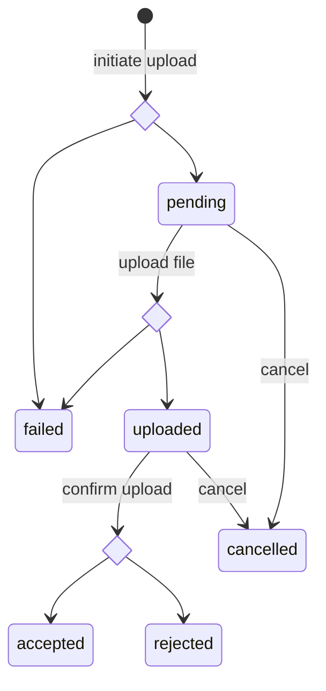

# Up-/Download Client & Production POC (Star-Nosed Mole)

## Scope:
A scope definition can be found here: https://wiki.verbis.dkfz.de/x/fAFzCQ

## User Journeys

This epic covers the following user journeys:

### Data Upload:


A Data Submitter specifies the file ID, the URL to the Upload Contoller API, and the file path on the local file system using the CLI interface of the client (1.0). Internally, the CLI client translates the user-defined data into a request to the Upload Contoller API to obtain an upload id (1.1). The client sends a request to the Upload Controller for each individual part of the uploaded file and recieves a presigned post for each individual part (1.2). The client reads multiple parts from the source file and uploads them as a stream using the pre-signed post (1.3). Once the upload has been completed the client sends a confirmation to the Upload Controller API (1.4).


### Data Download:


A Data Requester Specifies the file ID,the URL to the DRS3 API,and the anticipated destination on the local file system using the CLI interface of the client (1.0).Internally,the CLI client translates the user-defined data Into a request to the DRS3 API in order to get a pre-signed download URL (1.1). Typically, the requested file is not already in the outbox. Thusthe API Instructs the CLI client to retry the request after a specified time again. The client waits the specified time and then repeats the request. This is repeated until the DRS3 API responds with the desired pre signed URL (1.2). The client fetches the file's bytes using the pre signed URL (1.3) and saves them to the local file system (1.4).


## CLI:

### Upload CLI:
```
ghga-cli upload-by-id \
    --api_url <url_to_upload_contoller> \
    --file-id <file_id> \
    --file_path <file_path>
```


### Download CLI:
```
ghga-cli download-by-id \
    --api_url <url_to_drs3> \
    --file-id <file_id> \
    --output_dir <output_dir>
```

## UCS:

The following Updates are performed in the Upload Controller Service:

### Database:

A new table "multipart_uploads" is added, containing the following columns:
```
- upload_id (Primary key, UUID, unique) -> Database-Specific ID, never used anywhere outside
- s3_upload_id
- file_id (not unique)
- upload_status
```

upload_status is an Enum and can have the following values:

```
- pending
- cancelled
- failed
- uploaded
- accepted
- rejected
```

The column "upload_status" from then table "files" is removed.

Please note, not more that one upload per file_id may have a state that is set to `pending` , `uploaded`, or `accepted`. Moreover, within the list of states from uploads corresponding to one file, these `pending` , `uploaded`, and `accepted` are mutually exclusive.
This also means that once an upload attempt corresponding to a file is set to `accepted`, no new uploads can be created for that file. In a future epic, we will implement a mechanism that allows controlled re-upload of a file by explicitly requesting to depreciate an old upload. We might also consider an `is_open` flag that is specified per file to control whether new upload attempts are currently allowed for that file.
#### Valid State Changes



### API Definition:

[OpenAPI YAML](./api_definitions/rest/ucs.yaml) - [Swagger UI](https://editor.swagger.io/?url=https://raw.githubusercontent.com/ghga-de/epic-docs/main/4-star-nosed_mole/api_definitions/rest/ucs.yaml)

## Additional Implementation Details:

- [Typer](https://typer.tiangolo.com/) can be used to implement the CLI interface.
- Ideally, avoid piping file bytes through python directly as this will slow down the upload/download significantly. Wrappers around C-based tools such as [pycurl](http://pycurl.io/docs/latest/) should be preferred.
- The installation should make as little assumptions of the execution environment as possible to allow its usage on a large variety of compute infrastructures:
    - The package should have minimal dependencies.
    - The existing dependencies should allow maximal flexibility when it comes to versions.
    - The package should be cross-platform compatible (Linux, Windows, MacOS).
- The package should be installable via PyPI.
- Name of the package is up for debate.

## Benchmarking
This epic not only contains implementation work but the produced solution is also benchmarked against a production s3 system.

### Benchmarking Senario:
- upload and download large file > 200 GB
- backend: Ceph S3 in Tübingen and(/or) IMB COS at DKFZ, GHGA file services may be deployed to an arbritrary de.NBI Cloud location
- client: outside of backend network (e.g. private computer, or VM in different location), should have reasonably fast internet connection

### Benchmarking Criteria:
- throughput/speed: duration of the up- and download process, average transfer rate
- reliability: occurrence of sporadic errors/unavailabilities when repeated multiple times
- (optional) scalability: is the experience deteriorating when uploading multiple large files (from multiple clients) in parallel?


## Human Resource/Time Estimation:

Number of sprints required: 2

Number of developers required: 1.5 (=1 Developer + 0.5 DevOps)
