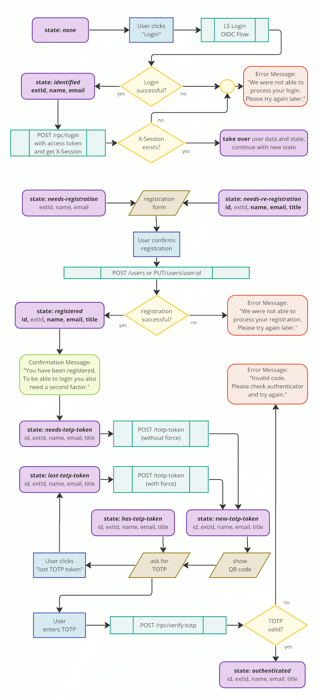
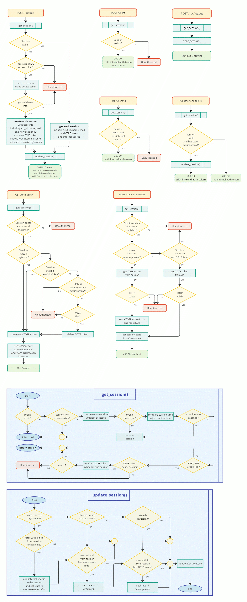
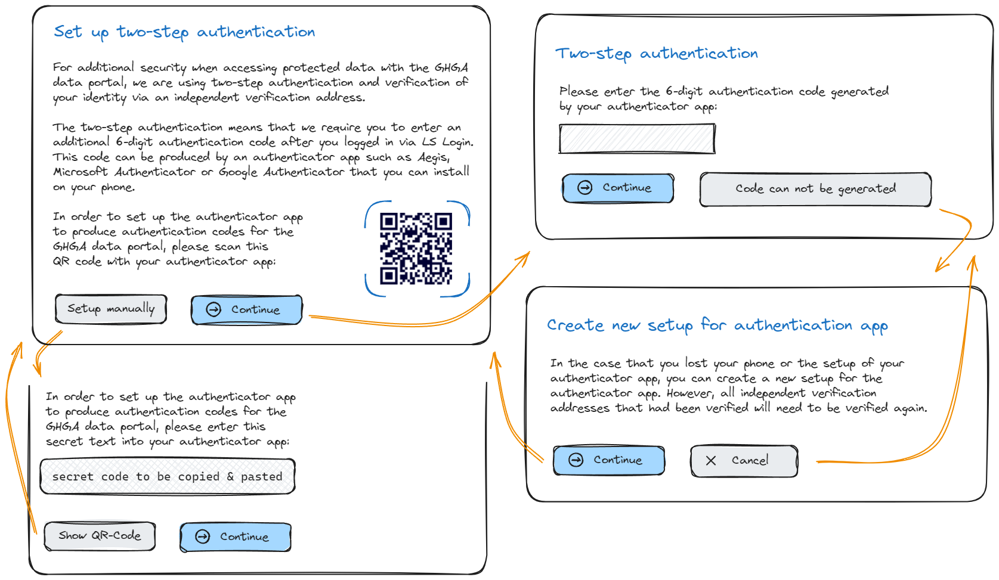

# Integrate 2FA and IVA functionality (Sugar Ant)

**Epic Type:** Implementation Epic

Epic planning and implementation follow the
[Epic Planning and Marathon SOP](https://docs.ghga-dev.de/main/sops/sop001_epic_planning.html).

## Scope

### Outline

This goal of this epic is to implement all the functionality necessary
to support two-factor authentication (2FA) and independent verification addresses (IVAs).

### Included/Required

The implementation must include all changes necessary to support the full functionality described
in [GFRC007: User authentication and identification](https://docs.ghga-dev.de/main/grfcs/grfc007_auth_and_identity.html)
and in the [white paper on 2FA and identity verification](https://docs.ghga-dev.de/main/white_papers/auth_and_identity.html).

These changes are outlined in the following sections. They affect both the frontend and the backend.

It has been decided to implement the frontend changes by extending the existing React-based code and not waiting for the planned migration to an Angular-based frontend. The frontend implementation should also cover required mocks for the new backend APIs.

On the backend side, mostly the auth adapter is affected, but also some other services.

### Optional

Some changes have been specified as optional in the sections below.

### Not included

- support for multiple TOTP tokens
- support for other kinds of 2FA factors
- integration tests (extending the Archive Test Bed)

## Implementation Details

The following sections describe the various parts of the backend and frontend that are affected by the implementation work in this epic, and the corresponding user journeys and new or changed APIs:

### Auth Session Management

The Auth Adapter must be extended with a cookie based auth session management.

This means the Auth Adapter should track user sessions using unique session IDs submitted via cookies. It also maintains an internal session store which stores the current user information and authentication state of the user. The session store should not be used for storing any other information about the state of the application.

The store will be implemented in memory in the first implementation. Another type of cache could be used later that would allow retaining sessions when restarting the auth adapter and support multiple instances of the auth adapter. Therefore the storage mechanism for the session cache should be made easily changeable.

The Auth Adapter creates an auth session and tracks users as soon as they have logged in via LS Login, but not earlier.

Instead of converting the OIDC access token to our internal auth token, the Auth Adapter should now convert the content of the user session into the internal auth token. The internal auth token will change a bit, as outlined in a section below.

The Auth Adapter must also be extended with a mechanism that prevents "session riding" attacks, using the "Cookie-to-header token" method. Thereby, the first request that creates the session responds not only with the session cookie, but also with a "CSRF cookie" which must be a unique and unpredictable string, either as a random string or derived from the session token via HMAC and an application secret. Contrary to the session cookie, the CSRF cookie must not be a Http-only token, because it must be read by JavaScript running in the frontend and copied to a CSRF-Token for each request to the backend. The Auth Adapter needs to compare the CSRF Token with the unique string set in the CSRF cookie.

See also: [ADR: user session management](https://github.com/ghga-de/adrs/blob/main/docs/adrs/adr004_user_session_management.md)

### TOTP Management

To implement two-factor authentication using TOTP, we need a mechanism to create and validate TOTP tokens. This functionality could be implemented as a separate service. However, the outcome of the validation of a TOTP should be stored in the auth session, so the most simple solution is to validate TOTPs inside the Auth Adapter, since it holds the auth session. And then it makes sense to let the Auth Adapter also handle the creation of the TOTP tokens, though technically this does not need to be part of the Auth Adapter and could be handled by a separate service. We decided to use this simple approach, implementing TOTP management in a module that is part of the Auth Adapter. The related endpoints would be intercepted by the Auth Adapter as part of the ExtAuth protocol, and handled by the TOTP management module.

The Auth Adapter should intercept the following four endpoints:

- `POST /totp-token` - *creates a TOTP token*
  - request body:
    - `user_id`: string (the registered User ID)
    - `force`: boolean (whether an existing TOTP can be replaced)
  - response body:
    - `uri`: string (the provisioning URI)
  - alternative response body:
    - `text`: string (the secret as text)
    - `svg`: string (URI as QR-code in SVG format)

This endpoint first verifies that the user has a valid auth session, i.e. has been successfully logged in via LS Login. It then verifies that the session refers to an already registered user, and that the user has the same user ID as specified in the request body. Next, if `force` is not set to `true`, it verifies that this user does not already have an active TOTP token. If any of these verification steps fail, it responds with the HTTP status `401 Unauthorized`. Otherwise, creates a TOTP token and returns its provisioning URI which also contains the secret (seed) used by this token as a query parameter, using the HTTP status `201 Created`.

The implementation only supports a single TOTP token per user. If an activated token (a TOTP token that has already been successfully validated at least once) already exists and the `force` flag is set to `true`, then the existing TOTP token will be replaced by the newly created one.

As a side effect of this endpoint, all existing IVAs associated with this user must be deleted, as required in the white paper for 2FA and IVAs.

The QR code should be created in the frontend, e.g. using `react-qr-code` or the `qr-code` web component. If during implementation there are any issues with this approach, it can alternatively also be created in the backend, e.g. using the `segno` library.

- `OPTIONS /rpc/verify-token` - *checks the existence of a TOTP token*

This endpoint first verifies that the user has a valid auth session, i.e. has been successfully logged in via LS Login and is a registered user. If this is the case, it then checks whether the user has already created an active TOTP token. A response HTTP header `Allow: OPTIONS, POST` is returned in this case or `Allow: OPTIONS` in all other cases. In any case an empty response with the HTTP status `204 No Content` will be returned (not `200 Ok` because that can not be returned using ExtAuth).

- `POST /rpc/verify-totp` - *verifies a one-time password*
  - request body:
    - `user_id`: string (the registered User ID)
    - `totp`: string (the one-time-password)

This endpoint first verifies that the user has a valid auth session, i.e. has been successfully logged in via LS Login. It then verifies that the session refers to an already registered user, and that the user has the same user ID as specified in the request body. Next, it verifies that this user has already created a TOTP token. Finally, it verifies the given one-time password in `totp` using the current time and a configurable time window. If all verification steps succeed, the token is activated, and the HTTP status `204 No Content` is send in an empty response. Otherwise, if the one-time password could be verified, it responds with the HTTP status `401 Unauthorized`.

- `POST /rpc/logout` - *removes the user session*
  - request body: empty

This endpoint simply removes the auth session that is tracked in the Auth Adapter, thereby effectively logging the user out. Returns an empty response with the HTTPS status `204 No Content`.

Note that none of these endpoints yields the HTTP status code `200 OK` so that the responses can be returned using the ExtAuth protocol. This particular status code could not be used here because it would indicate a successful authentication, i.e. the response would be ignored and the request would be passed on by the API gateway.

The auth session should be created when the endpoint `GET /users/{ext_id}` is called with an external user ID in the path that corresponds to the access token from LS Login in the Authorization header. This endpoint is called by the frontend after the OIDC flow in order to check whether the user is already registered, and therefore indicates a user login. When an auth session already exists and any other request is made, the expiration date of the session should be automatically extended. The timeout for auth sessions and their maximum duration should be made configurable.

The application logic for the TOTP related endpoints should be implemented in the TOTP Management module. This module should also implement rate limiting and replay attack prevention.

See also: [ADR: custom 2FA micro service](https://github.com/ghga-de/adrs/blob/main/docs/adrs/adr003_custom_2fa_service.md)

### IVA management

The management of IVAs (independent verification addresses) should happen in the User Management service.

For the definition of an IVA, see the section on backend models below.

The following three REST-style endpoints should be added to the User Management service:

- `GET /users/{user-id}/ivas`
  - *returns the list of IVAs belonging to the specified user*
  - auth header: internal token (of data steward or same user)
  - response body:
    - list of IVA objects
- `POST /users/{user-id}/ivas`
  - *creates an IVA for the specified user*
  - auth header: internal token (of data steward or same user)
  - request body:
      - `type`: enum (phone, fax, postal address, in-person)
      - `value`: string (the actual phone number)
	- response body:
      - `id`: string (the ID of the newly created IVA)
- `DELETE /users/{user-id}/ivas/{iva_id}`
	- *deletes an existing IVA of the specified user*
	- auth header: internal token (of data steward or same user)

Additionally, the following three RPC-style will be added:

- `POST /rpc/ivas/{iva_id}/unverify`
  - *invalidate the specified IVA*
  - auth header: internal token of a data steward
  - response status:
    - `204 No Content`: state changed to `unverified`
    - `401 Unauthorized`: auth error (e.g. not a data steward)
  - *should also send a notification to the user*
- `POST /rpc/ivas/{iva_id}/request-code`
  - *request the verification of the specified IVA*
  - auth header: internal token
  - response body: empty
  - `200 No Content`: state has been changed to `code_requested`
  - `400 Bad Request`: IVA did no the state `unverified`
  - `401 Unauthorized`: auth error (e.g. IVA not of current user)
  - *should also send a notification to the user and a data steward*
- `POST /rpc/ivas/{iva_id}/create-code`
  - *create verification for the specified IVA*
  - auth header: internal token of a data steward
  - response body:
    - `verification_code`: string (to be transmitted to the user)
  - response status:
    - `200 OK`: state has been changed to `code_created`
    - `401 Unauthorized`: auth error (e.g. not a data steward)
- `POST /rpc/ivas/{iva_id}/code-transmitted`
  - *confirm the transmission of the verification code for the specified IVA*
  - auth header: internal token of a data steward
  - response status:
    - `204 No Content`: state has been changed to `code_created`
    - `400 Bad Request`: IVA did no the state `code_created` or `code_transmitted`
    - `401 Unauthorized`: auth error (e.g. not a data steward)
  - *should also send a notification to the user*
- `POST /rpc/ivas/{iva_id}/verify-code`
  - *submit verification code for the specified IVA*
  - auth header: internal token
  - request body:
    - `verification_code`: string (that had been transmitted to the user)
  - response status:
    - `204 No Code`: verification code correct, IVA is now in state `verified`
    - `400 Bad Request`: IVA did no the state `code_transmitted`
    - `401 Unauthorized`: auth error or verification code was wrong
    - `429 Too Many Requests`: IVA has been reset to unverified
  - *should also send a notification to the data steward*

### Claims Repository

The `Claims` model must provide a new `iva_id` field, as also specified in the section on backend model changes below.

The claims repository currently has an endpoint

- `POST /download-access/users/{user_id}/datasets/{dataset_id}`

This endpoint must be extended to become

- `POST /download-access/users/{user_id}/ivas/{iva_id}/datasets/{dataset_id}`

The claims repository also has endpoints at

- `GET /download-access/users/{user_id}/`

The routes of these endpoints do not need to be changed. However, these endpoints must now also check that the corresponding claims are bound to IVAs that have been verified for the given user.

### Access Request Service

The `AccessRequest` model should have a new optional `iva_id` field, as specified in the section on backend model changes below.

The `PATCH /access-requests/{access_request_id}` endpoint that is used to allow or deny access requests must be extended so that it also accepts the corresponding `iva_id` in the body. The `iva_id` must then also be passed to the claims repository.

### Internal Auth Token

Until now, an internal auth token was created and passed by the Auth Adapter via the API gateway after the user was successfully authenticated via LS Login. The token contained an additional `status` enum (active, inactive, invalid). It could contain the internal or external user id in the fields `id` and `ext_id`.

In the new implementation, we change the internal auth token as follows:

The internal auth token will be only created and passed on by the Auth Adapter if the user is fully authenticated, i.e. logged in via LS Login and the second factor has been validated.

The `status` field will be removed from the auth token. The existence of the token always implies that the user account is active and not invalid.

The `ext_id` field will be removed from the auth token. There are only two exceptional cases where it is needed, and in theses cases it can be stored in the `id` field instead. The `id` field will also be made mandatory and required to be a non-empty string.

There are only the following three exceptions where the auth token will be also added by the Auth Adapter if the user is only logged in via LS Login:

- `POST /users`
  - used to self-register a user
  - the `id` field of the auth context will contain the external id, not the internal id
- `PUT /users/{user_id}`
   when requested by users to confirm a name an email change
  - the user must be already registered
  - the `id` field of the auth context will contain the internal id of the user, and it must correspond to the `user_id` in the path
- `GET /users/{ext_id}`
  - when requested by users to check their own registered data
  - the `id` field of the auth context will contain the external id, not the internal id, and it must correspond to the `ext_id` in the path

### Service Commons Library

The `ghga-service-commons` library must be changed to reflect the changes in the internal auth token as outlined above.

### Backend Models

A new `IVA` (independent verification address) model must be added to the User Management service:

  - `id`: string (unique internal id)
  - `user_id`: string (internal id of the user)
  - `type`: enum (`phone`, `fax`, `postal_address`, `in_person`)
  - `value`: string (the actual phone number)
  - `verification_code_hash`: optional string (hash of actual verification code)
  - `verification_attempts`: int (number of attempts to verify the code)
  - `state`: enum (`unverified`, `code_requested`, `code_created`, `code_transmitted`, `verified`)
 - `created`: date (of creation)
 - `changed`: date (date of last change)

The `IVA`s should be maintained in a separate collection by the User Management service.

The `verification_code_hash` and `verification_attempts` fields should only be stored in the database and not be returned via the REST interface. The verification code itself should be created randomly and only be shown to the data steward or transmitted
directly to the user, it should not be stored in the database.
The `verification_code_hash` should be created using a random salt and a dedicated password hashing algorithm from the verification code.
The `verification_attempts` field tracks how often the user attempted to send the verification code in the `code_transmitted` state.
After three failed attempts or when the `last_changed` field indicates
that the verification process takes too long ago (the number of days should be configurable), the state should be set back to `unverified`.
The `state` transitions from `unverified` (after creation),
over `code_requested` (user requested a verification),
`code_created` (a verification code has been created)
and `code_transmitted` (the verification code has been transmitted to the user)
to `verified` (the user confirmed the receipt of the verification code by returning it properly).

The `Claims` model must be extended so that claims in addition to referencing a user, it can optionally also reference an `IVA` via an additional property `iva_id`.

A new `TOTPToken` model must be created that includes all attributes required to operate a TOTP token, like the OTP secret key that it is based upon (details will be defined during implementation).

The `TOTPToken`s will be managed by the Auth Adapter, as explained above.

The `AccessRequest` model must be extended to also include an optional `iva_id` field referencing an IVA that is used to verify the corresponding access grant. This field will be initially set to `None`, and it will be set after access has been allowed.

### Login Flow in the Frontend

The frontend keeps the state of the current user in the session storage. The in the frontend can be one of the following stages:

- `unauthenticated`
- `identified` (logged in via LS Login)
- `needs-registration`
- `needs-reregistration`
- `registered`
- `needs-totp-token`
- `lost-totp-token`
- `has-totp-token`
- `authenticated` (fully logged in with TOTP)

The user starts in the state `unauthenticated`. Only when the last stage has been reached, the user is considered fully authenticated.

To initiate the authentication process, the user must first log in via LS Login and the OIDC flow must have been completed, at the end of which the frontend receives an OIDC access token. After that, the state is moved to `identified`.

Now let's assume the user is in the state `identified`.

The frontend then requests the user data from the user management service using the `GET /users/{ext_id}` endpoint, passing the LS Login ID and the access token. On the backend side, this will create an auth session as side effect.

If the user is already registered, the frontend gets the internal user ID and the user info (particularly, the name and email) in the response, and the state is set to `registered`.

If the user is not yet registered, the state is set to `needs-registration` and the frontend asks the user to register.

If the user info from LS Login does not match the registered user info, the user will not be considered valid by the backend, the state is set to `needs-reregistration`, and the frontend should show a message accordingly, asking the user to confirm and thereby re-register.

TODO: Should we send a notification to a data steward in this case, or maybe even invalidate existing TOTP tokens and IVAs?

If the state is `needs-registration` or `needs-reregistration`, the user is requested to newly register or confirm the changed user data. Registration of users has already been implemented in the frontend and in the backend and does not need to be changed. After registration, the frontend also gets the user info from the backend and stores it in the session storage.

 We now assume the user is in the state `registered`, and the frontend therefore knows the internal user ID and the user info by looking it up in the session storage. But it does not know yet know whether the user already created a TOTP token as second factor.

Therefore, the frontend checks whether the user already created a TOTP token using the `OPTIONS /rpc/verify/totp-token` endpoint. If this returns "POST" as allowed method, the user is moved to the `has-totp-token` state, otherwise to the `needs-totp-token` state.

Let's assume the user is in the `needs-totp-token` or `lost-totp-token` state. The frontend then uses the `POST /totp-token` endpoint to create a provisioning URI, whereby the `force` flag should be set if and only if the user is in the state `lost-totp-token`. The frontend then presents the returned URI in form of a QR code to the user and asks the user to scan the QR code using an authenticator app. It should also show a button or link to display the secret as text as fallback for manually entering the secret.

The frontend should recommend using Aegis as authenticator app. Google authenticator is not recommended, since it does not require unlocking the phone, and Authy is not recommend since it stores the secrets in the cloud, and does not provide a means for the user to retrieve them, which makes it impossible to migrate them to another app.

On the same page, the frontend also asks the user to enter the one-time password (six-digit code) shown in the authenticator app to validate the creation of the second factor in a text input field.

Now let's assume the user is in the `has-totp-token` state. In that case, a similar text input field should be presented to the user, asking them to enter the one-time-password (six-digit code) shown in the authenticator app for authentication.

The user is also shown a link that allows re-creating the second factor. This link can be used in the case they lost the phone with the authenticator app and do not have a backup of the secrets. Following the link, after a warning that all independent verification addresses will be invalidated, the user state should be set to `lost-topt-token`.

When the user submits the one-time-password, the frontend uses the `POST /rpc/verify-totp` endpoint to check its validity.

If the password is validated, the user is moved to the state `authenticated`, otherwise an authentication error is displayed and the state stays the same.

The frontend must also change the "Logout" button so that it calls the `/rpc/logout` endpoint of the Auth Adapter.

### Access Request Management

A few changes need to be made to the access request functionality implemented in the frontend.

The Access Request Submission Form does not need to be changed, the IVA is not required at this time. TODO: Check with Leon's document. May also be later added.

The Access Request Browser itself does not need to be changed either. It may interesting to show the corresponding IVA for allowed accesses, but this does not need to be implemented as part of this epic.

However, the Access Request Details Form that allows granting or denying access needs some changes.

In addition to the "allow" and "deny" buttons, it should also have a selector that shows the types, values and states of the IVAs created by the corresponding user. The "allow" button should only be activated when one of the IVAs is selected. If the user has already been granted access using a given IVA, this should also be clearly indicated.

### IVA Verification

On the user profile page, it should be possible to create one ore more IVAs and to list the existing IVAs of the user.

The IVA creation dialog should allow to select the type and enter the value of the new IVA.

For existing IVAs, their state and the number of bound datasets should be displayed. Each IVA should have a "delete" button. When an IVA is still bound to a dataset, a warning should be displayed before the deletion.

Each existing IVA in the state `unverified` should have a button "request verification". Each IVA in the state `code-transmitted` should have a button `verify`.

After clicking "request verification", the state of the IVA should be moved from `unverified` to `code_requested`, a confirmation email should be sent to the user and a notification email should be sent to a data steward.

After clicking "verify", the verification code should be requested from the user via an input field, and the
the state of the IVA should be moved from `code-transmitted` to `verified`. If this does not succeed, a corresponding error message must be shown to the user. After three failed attempts or when the verification code expired, users should be informed that they need to re-request the verification because the verification code expired.

After the user requested verification, a data steward should have received a notification. The data steward should be able to access an "IVA browser" page that lists all users and their IVAs, similar to the "access request browser". The IVAs in the state `code_requested` or `code_created` should have a button "(Re)create code". After clicking the button, the IVA should be moved to the state `code_created` and a dialog should appear that shows the verification code and ask the data steward to send it to the user via the selected IVA. The dialog should have three buttons: "Cancel" would revert the creation of the code and reset the state to `code_requested`, "Send later" would do nothing, but remind the data steward to confirm the transmission of the code later, and "Confirm transmission" would move the IVA to the state `code-transmitted`. This will also notify the user via an email that the code has been transmitted. Of course the code itself should *not* be sent in the notification email since it is expected to be sent via the transmission channel specified in the IVA. The IVAs in the state `code_created` should also have a button "confirm transmission". All IVAs should also have a button "Invalidate" that would reset its state to `unverified`.

The RPC-style endpoints that can be used to move the state of the IVAs and send corresponding notifications are explained in the section "IVA Management" above.

## Flow Diagrams

### Login Flow in the Frontend

The following flow diagram visualizes the login flow in the frontend.

### Auth Flow in the Backend

The following flow diagrams visualize the backend flows for the various routes
that are handled by the Auth Adapter.

Note that per the ExtAuth protocol, a response with a status code of "200 OK"
means that the route is considered valid by the API gateway
and forwarded to the corresponding micro service.
Any other status code in the response causes the response to be directly
passed back to the client.

## UI Wireframes

### Login flow

TODO:

- IVA management on the profile page
- IVA browser
- access request detail form

## Human Resource/Time Estimation:

Number of sprints required: 5

Number of developers required: 2
