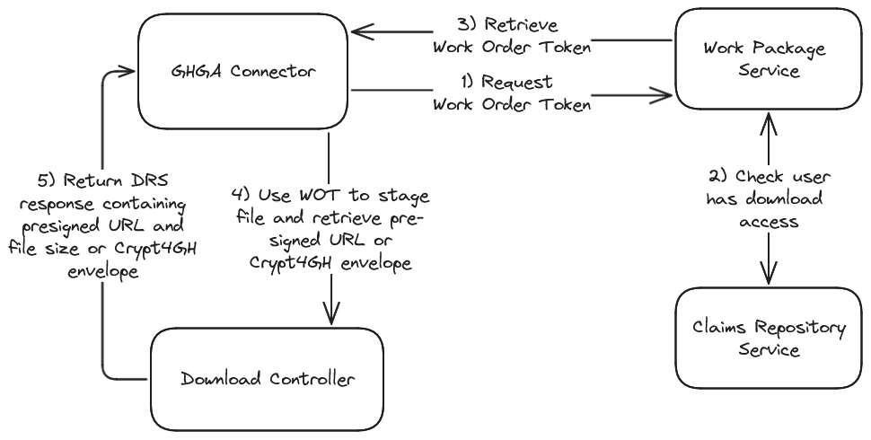

# Download Path Service Response Caching (Thorny Devil)

**Epic Type:** Implementation Epic

Epic planning and implementation follow the
[Epic Planning and Marathon SOP](https://docs.ghga-dev.de/main/sops/sop001_epic_planning.html).

## Scope

### Outline:

This epic aims to ameliorate some issues that currently arise when communicating with the RESTful APIs on the download path. 
These changes target the GHGA Connector, the Download Controller, Work Package and Claims Repository services.
The goal is to effectively reduce the amount of requests that are made by introducing response caching where reasonable and simplifying/improving the connector code. 

### Included/Required:

#### General Caching Strategy:

For all services that return responses that should be cached, a consistent caching strategy should be employed. 
This might include some research into best practices, figuring out which headers need to be sent along in responses and requests and which additional reponse status codes need to be produced and handled.
Sometimes there are alternative ways to achieve the same result with different implications, i.e. returning an `Expires` or `Cache-Control: max-age` header.

A prime candidate for a caching library for httpx is [Hishel](https://hishel.com/), but alternatives should be investigated if needed.
The recommended way to cache responses using `Hishel` is to use one of the two `Transport`s it provides, which can be easily injected into already exisisting `httpx` clients.
Additionally, the question where the cached data is stored needs to be answered. 
Can we simply use a local file based cache, can we get by with using an in memory cache or do we need something more involved?

#### Claims Repository:

The response returned by the check download access endpoint (`/download-access/users/{user_id}/datasets/{dataset_id}`) should be turned into a cacheable response.
The chosen expiration time for the response should be the source of truth from which the Work Package service derives the lifetime of the work order token.

#### Work Package Service:

The response of the work order token endpoint (`/work-packages/{work_package_id}/files/{file_id}/work-order-tokens`) should be turned into a cacheable response, with the expiration guided by the lifetime of the work order token.

#### Download Controller Service:

Responses to the DRS compliant `/objects/{object_id}` endpoint should be cacheable for the lifetime of the presigned S3 URL included in the response once the corresponding file has been staged. The retry later response of this endpoint should, for obvious reasons, not be cached and the service might need to send a corresponding header along to enforce this behaviour.

#### GHGA Connector:

The Connector currently performs too many unneeded requests to the Work Package and Download Controller services.
The amount of requests can be reduced by 1) caching responses from the Work Package service so that a work order token can be reused during the concurrent download of file parts and 2) caching the response from the Download Controller so one presigned URL can be reused as long as it remains valid.

## Additional Implementation Details:

The image below shows the relevant parts of the current interaction chain where HTTP requests and responses are involved in the file download. The retry later response from the DCS is omitted for simplicity's sake.

In the current current implementation of the connecter, this cascade of calls is triggered on several occasions:
- Initially, for all file IDs retrieved from the work package, the DCS is called to check if a file is already staged and if not, to stage it. This happens for all file IDs in sequence before even attempting to download a file.
- Before starting a file download, another call to the DCS is made to obtain the file size.
- One further call is made to fetch a Crypt4GH envelope for the file that is to be downloaded
- During the download of the actual file, for every file part a call is made to obtain a new presigned S3 URL

Each one of these calls to the DCS requires a preceeding call to the Work Package service at the moment.
Two different and independent expiry times are involved:
- The work order token has to be used in the call to the DCS before it expires
- The presigned S3 URL has to be used to initiate a part download before it expires

## Human Resource/Time Estimation:

Number of sprints required: 1

Number of developers required: 2
