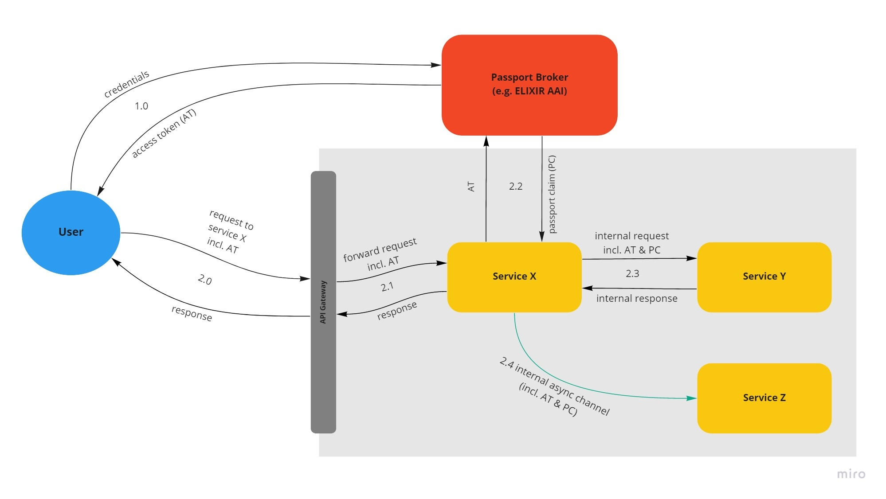
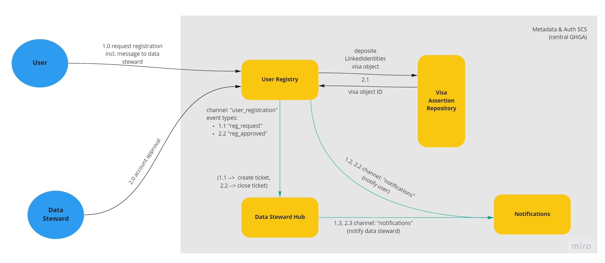
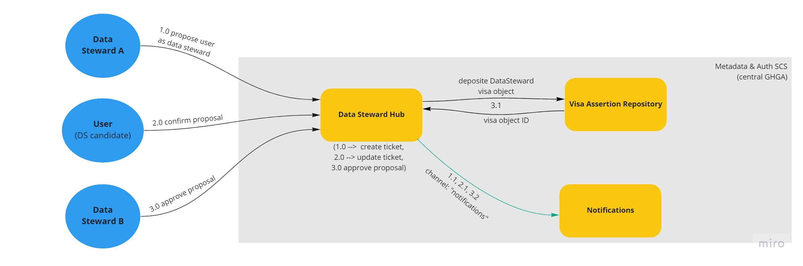

# GA4GH-oriented Auth Concept (Carpenter Ant) 

**Epic Type:** Exploratory Epic

## Principle Components of Exploration:

A scope definition can be found here: https://wiki.verbis.dkfz.de/x/YgFzCQ

### Adaptation to latest versions of GA4GH AAI and passport standards:

- Synchronize with the GA4GH DURI workstream.
- Learn about the latest changes to the GA4GH AAI and passport standards (v1.2), and possible future developments (v2).
- Investigate existing use cases and implementations (NIH, ELIXIR, REMS, EGA etc.).
- Verify that the user journeys described below are feasible, flesh out details, and develop alternative proposals if necessary.
- Explore (dis-)advantages of the proposal that are currently evaluated regarding:
  - embedded passport token
  - work order token

### Usage of LS AAI as passport broker:

- Synchronize with ELIXIR.
- Evaluate whether the distribution of GA4GH visa via LS AAI as a passport broker is feasible, check legal and technical aspects of this.
- Evaluate possible alternative solutions for sending passports to LS AAI, e.g. via EGA.
- Evaluate alternative solution where GHGA operates its own passport broker, using LS Login as IdP only.

### Handling of passport and visa expiry and revocation:

- Suggest solutions for the authentication of long-running tasks (e.g. download, upload, data processing, etc.), and check legal requirements regarding expiration.
- Develop a visa/auth revocation strategy, and check legal requirements for this.

## Material and Resources:

- [GA4GH Passports and the Authorization and Authentication Infrastructure](https://www.ga4gh.org/news/ga4gh-passports-and-the-authorization-and-authentication-infrastructure/)
- [GA4GH AAI background](https://ga4gh.github.io/data-security/1.2-draft-main/aai-introduction)
- [GA4GH AAI OIDC profile](https://ga4gh.github.io/data-security/1.2-draft-main/aai-openid-connect-profile)
- [GA4GH Passport V1](https://github.com/ga4gh-duri/ga4gh-duri.github.io/blob/master/researcher_ids/ga4gh_passport_v1.md#ga4gh-passport)

More resources can be found here: https://wiki.verbis.dkfz.de/x/mwv4Bg

## User Journeys

This epic covers the following user journeys:

### Client-Service Interaction with API Gateway-mediated Auth

(1.0) A user accesses the GHGA data portal and explicitly logs in or navigates to a page that requires authentication. The data portal will redirect the user to a GA4GH compliant passport broker (e.g. LS Login), starting an OIDC flow. The details of this are covered in the "wood ant" epic. As a result, the client will get a passport-scoped access token in GA4GH JWT format. This access token contains a unique user identifier, but no GA4GH claims. The access token is stored securely in the client.

(2.0) Whenever the user now contacts a service that needs authorization (in this example Service X), the client sends the access token in the request header.

(2.1) The request first hits the API Gateway. Before forwarding the request to the targeted service, the API Gateway sends the access token to the Auth Adapter, which can be a standalone service or just a small Python function injected into the gateway.

(2.2) The Auth Adapter uses the access token to contact the GA4GH compliant passport broker. The Passport Broker collects all GA4GH passport visas for the corresponding user and sends them back as a GA4GH passport claim (essentially a list of visas). Each visa describes a specific role or permission of the corresponding user in form of a JWT token.

(2.3) The API Gateway attaches the passport claim to the body of the user's original request and forwards this modified request to the targeted service. The service interprets the passport claim autonomously to evaluate whether the user is allowed to carry out the requested action or retrieve the requested data. The response of the service travels back to the user's client via the API Gateway.

(2.4) If the targeted service has to contact other services as part of the request (both synchronously and asynchronously), it should forward the access token as well as the passport claim to the downstream services.

Alternatively, the retrieval can also be realized in the target services, which would then take over the function of the Auth Adapter, as depicted in the following diagram:

### Creation and Distribution of GA4GH Passport Visas

Some visas might be retrieved from an external source like EGA, however, most visas we are using have to be issued by our system. The workflow for creating and distributing these visas is shown in the following diagram:

(1.0) Selected services (e.g. User Registry or DAC Hub) may act as GA4GH passport visa source and are allowed to deposit GA4GH passport visa objects at the Visa Assertion Repository as per the specs for the GA4GH passport visa assertion repository. The Visa Assertion Repository deposits the visa objects in a dedicated database.

(2.0) Any service in our system that requires authorization may act as GA4GH passport clearinghouse. Thus it sends a GA4GH access token to a GA4GH passport broker to retrieve a GA4GH passport claim for the access token-specific user.

(2.1) To answer this request, the Passport Broker contacts the Visa Issuer that acts as per the GA4GH passport visa issuer specs. The Visa Issuer shares the Visa Object Database with the Visa Assertion Repository, however, it only has read rights to it. Technically, the Visa Issuer and the Visa Assertion Repository should be considered as the same service that was broken up into a read and a write component because of security reasons. The Visa Issuer looks up all visa objects for the corresponding user. Then it signs them to create actual GA4GH passport visas (JWT tokens) which are sent back to the Passport Broker.

(3.0) Visa Sources may revoke visa objects at any time: In case the condition that led to the creation of a visa object is not fulfilled anymore, visa sources may render the visa objects invalid by contacting the Visa Assertion Repository. However, a visa source is only allowed to revoke visa objects it has previously created.

### Registration of New Users

In principle, any user that authenticates via an external passport broker could carry out the auth workflow described above. However, we may want to restrict access for some interactions to only a subset of users that are registered in the GHGA system.

These user registrations may partially take place automatically (e.g. users of a specific institution might always be allowed to register), but in some cases (e.g. unknown/untrusted affiliation), they must be approved manually by a GHGA Data Steward, as show in the following diagram:

(1.0) Users have to first log in via the passport broker using their institutional account. Thereafter, GA4GH access tokens as well as GA4GH passport claims are retrieved as described above. The user sends a registration request to the User Registry.

(1.1) Thereby, the user includes a message to the data steward. The User Registry publishes an event to the "user_registration" channel. This triggers the creation of a ticket in the Data Steward Hub to which a Data Steward is automatically assigned.

(2.0) A Data Steward sends an approval (or rejection) to the User Registry.

(2.1) In case of approval, the User Registry deposits a GA4GH passport visa object of the standard type "LinkedIdentities" to the Visa Assertion Repository, i.e. the User Registry acts as a visa source as described above. This visa links the user's external identity to a GHGA internal user identity.

(2.2) Moreover, an event is published that informs the Data Steward Hub of the approval which causes the closing of the corresponding ticket.

The User Registry and the Data Steward Hub notify the user and the data steward, respectively, upon every relevant event using the Notifications service (1.2, 2.2, 1.3, 2.3)

### Registration of a User as Data Steward

Data Stewards are the super users of GHGA as they have special permissions at many components of our system. These permissions are again enforced through GA4GH passport visas as described in the following diagram:

(1.0) An existing Data Steward can contact the Data Steward Hub to nominate a user, who has already been registered to GHGA, as Data Steward. This leads to the creation of a ticket in the Data Steward Hub.

(2.0) The user confirms the nomination by contacting the Data Steward Hub. The ticket in the Data Steward Hub gets updated and another Data Steward (not the one who nominated the user) is assigned.

(3.0) The other Data Steward sends an approval to the Data Steward Hub.

(3.1) This leads to the deposition of a GA4GH Passport Visa object of the custom type "DataSteward" to the Visa Assertion Repository.

Any relevant notifications to the Data Steward or the nominated user are taken care of by the Data Steward Hub by contacting the Notifications service (1.1, 2.1, 3.2)

### Data Submission and Request Negotiation

The process of the formation of a dataset and an associated DAC and the negotiation between the user (and potential co-applicants) who apply for access to a specific dataset and the DAC involve the deposition of certain GA4GH passport visa, as described above under "Creation and Distribution of GA4GH Passport Visas".

## Human Resource/Time Estimation:

Number of sprints required: 3

Number of developers required: 1
