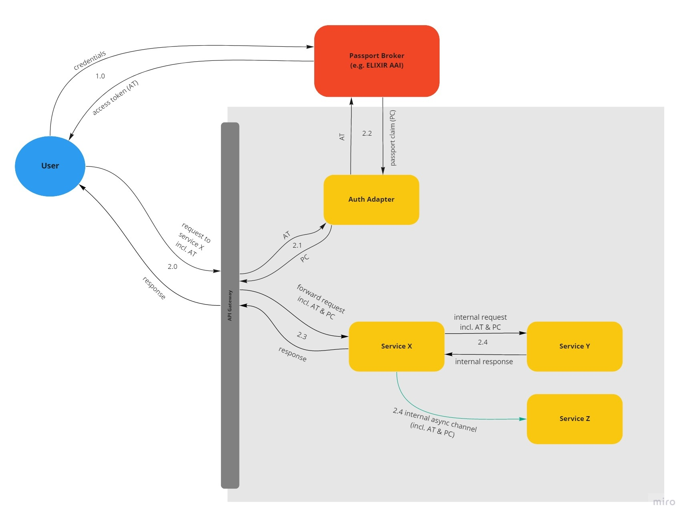

# Life Science AAI as Identity Provider (Wood Ant)

**Epic Type:** Exploratory Epic

## Principle Components of Exploration

A scope definition can be found here: https://wiki.verbis.dkfz.de/x/cQFzCQ

### Examine requirements for relying parties (RPs)

- Check and document the legal, organizational, and technical policies and requirements for using LS Login as a relying party
- Verify that GHGA can meet these requirements
- Document certified OIDC RP libraries that can be used by GHGA services

### Register GHGA as RP to LS AAI

- Install an OIDC RP software for testing
- Register the test software to the LS AAI test environment
- Move it to the LS AAI production environment

### Examine availability for end-users

- Check whether all potential end-users of GHGA services can use LS Login, document possible limitations

### Demo implementations

- Demo implementation for LS Login in Frontend (SPA)
- Demo implementation for getting user information from LS AAI in a backend service
- Demo implementation for LS Login using CLI

## Material and Resources

- [Life Science Login](https://lifescience-ri.eu/ls-login.html) website
- [OpenID Connect](https://openid.net/connect/) website
- [OAuth 2.0 Security Best Current Practice](https://oauth.net/2/oauth-best-practice/)

## User Journeys

This epic covers the aspect of using LS Login as identity provider in the following user journeys:

### Client-Service Interaction with API Gateway-mediated Auth

A user accesses the GHGA data portal and explicitly logs in or navigates to a page that requires authentication. The data portal will redirect the user to LS Login, starting an OIDC Authorization code flow. As a result, the client will get an access token which is stored securely in the client.

(2.0) Whenever the user now contacts a service that needs authorization (in this example Service X), the client sends the access token in the request header.

(2.1) The request first hits the API Gateway. Before forwarding the request to the targeted service, the API Gateway sends the access token to the Auth Adapter, which can be a standalone service or just a small Python function injected into the gateway.

(2.2) The Auth Adapter uses the access token to contact the LS Login user info endpoint to obtain any further information needed for identifying and authorizing the user. This would ideally be a GA4GH passport claim, as explored in the "carpenter ant" epic.

(2.3) The API Gateway attaches the user information to the body of the user's original request and forwards this modified request to the targeted service. The service interprets the authorization information autonomously to evaluate whether the user is allowed to carry out the requested action or retrieve the requested data. The response of the service travels back to the user's client via the API Gateway.

(2.4) If the targeted service has to contact other services as part of the request (both synchronously and asynchronously), it should forward the access token as well as the passport claim to the downstream services.

Alternatively, the retrieval can also be realized in the target services, which would then take over the function of the Auth Adapter, as depicted in the following diagram:

## Human Resource/Time Estimation

Number of sprints required: 3

Number of developers required: 1
