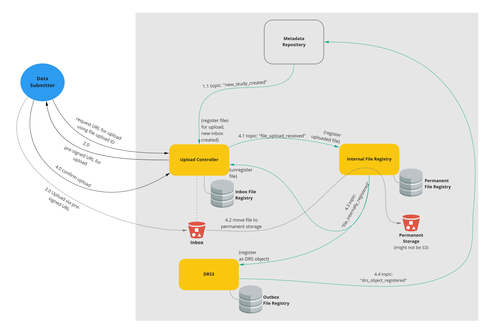

# \<Epic Title\> (\<Epic Code Name\>)
**Epic Type:** Exploratory Epic

\<Please replace all appearances of `<...>`.\>

## Principle Components of Exploration:

\<Try to decompose the exploratory epics into components or categories of tasks:\>

- \<Provide a list here.\>

## Material and Resources:

\<List any materials to be studied (e.g. articles, book chapters, youtube videos, etc.) and any (external) persons/experts to talk to here:\>

- \<Provide a list here.\>

## User Journeys

\<This is optional for exploratory epics\>

This epic covers the following user journeys:

\<Images and descriptions of user journeys go here. Images are deposited in the `./image` sub-directory.\>

## User Journeys that are not part of this Epic:
\<This is optional for exploratory epics\>
#
- \<Provide a list here.\>

## Technical planning:

Number of sprints required: \<Insert a number.\>

Number of developers required: \<Insert a number.\>
