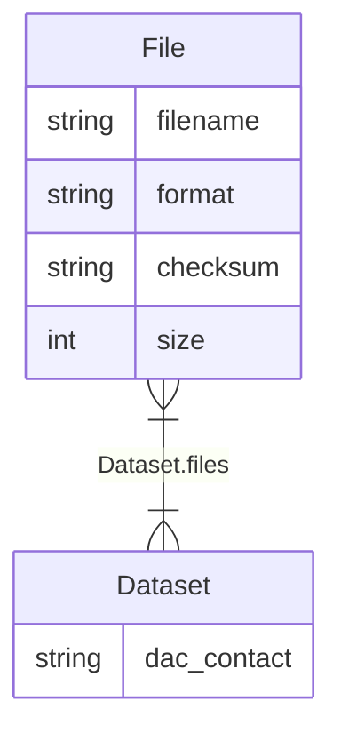

# Detailed Entity Relationship Diagram

*The following diagram provides details on the classes,
their content, and their relations to each other:*

```mermaid
erDiagram
    File }|--|{ Dataset: "Dataset.files"
    Dataset {
        string dac_contact
    }
    File {
        string filename
        string format
        string checksum
        int size
    }
```
