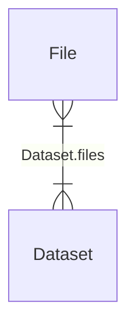

# GHGA Metadata Model

*A highly simplified GHGA metadata model.
This is just for demonstration purposes.*

## Relationships:
The following diagram provides an overview of all classes and their relations:

(An entity relationship diagram with further details can
be found [here](./detailed_erd.md))

# Classes:
Please find a description for each class and a link to
further details in the following:

| Class Name | Description | Details |
| ---------- | ----------- | ------- |
| Dataset | A dataset that is a collection of files. | [details](./classes/Dataset.md) |
| File | A file is an object that contains information generated from a process, either an Experiment or an Analysis. | [details](./classes/File.md) |
